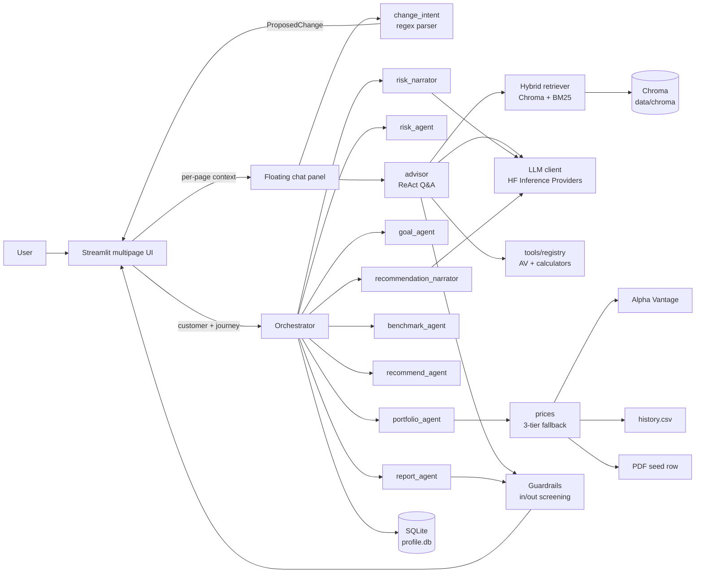
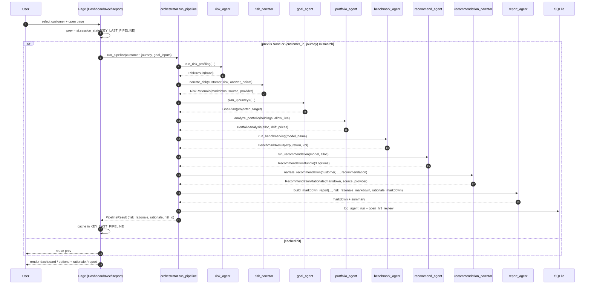
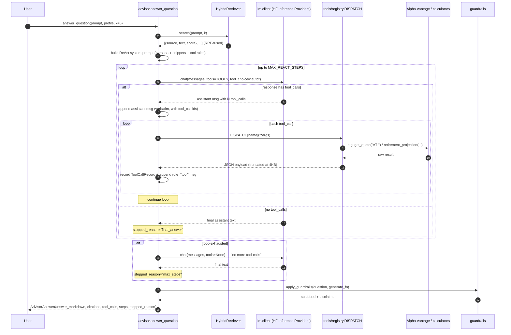
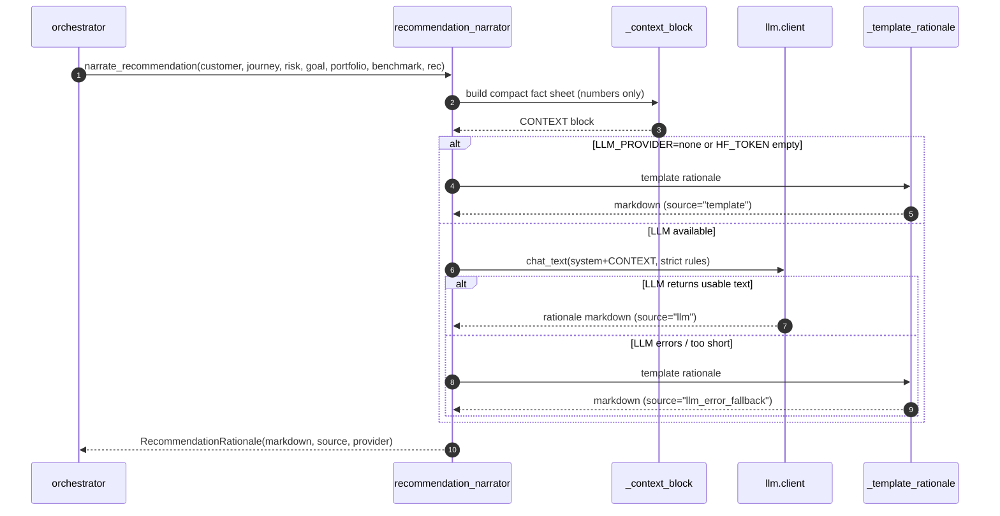
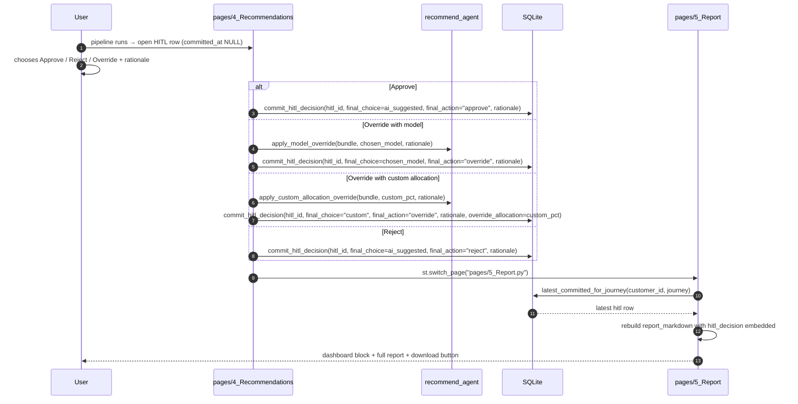
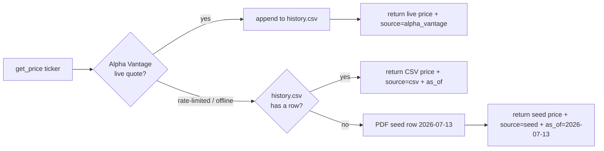
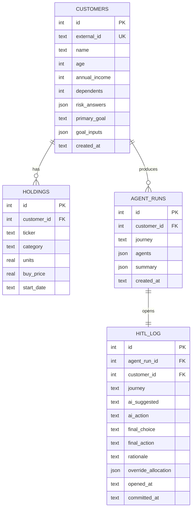

# NexWealth AI — Architecture

**Product:** *FinAdvisor* — an AI-native wealth-management experience delivered as a
Streamlit multipage app with a docked chat panel that grounds every answer in the
current page's context and can drive structured changes to the underlying plan.

This document describes the system as it exists in the repo today: layers, files,
data flow, and how the pieces stitch together. Read it top-to-bottom for a full
walkthrough or jump to the section you need.

- [1. High-level architecture](#1-high-level-architecture)
- [2. Layered view](#2-layered-view)
- [3. Repository structure](#3-repository-structure)
- [4. Component reference](#4-component-reference)
- [5. Flow diagrams](#5-flow-diagrams)
- [6. Data model](#6-data-model)
- [7. Sample-lens journey handling](#7-sample-lens-journey-handling)
- [8. Configuration and secrets](#8-configuration-and-secrets)
- [9. Observability and tests](#9-observability-and-tests)

---

## 1. High-level architecture



**Two entry paths converge in the UI:**

1. **Planning pipeline** — eight chained agents (six deterministic + two grounded LLM
   narrators — one over the risk band, one over the recommendation) produce a full
   recommendation and report for one of three planning journeys (Retirement / Child
   Education / Buy Home).
2. **Grounded Q&A (ReAct)** — the advisor agent runs a Reason → Act → Observe loop
   over 12 tools (Alpha Vantage market data + deterministic financial calculators)
   plus RAG snippets, answering open-ended finance questions with inline citations and
   a tool-call audit trail.

The **floating chat** sits on top of both — it reads the current page's context, decides
whether the user's message is a *change intent* (drives the pipeline) or a *question*
(routes to the advisor), and confirms every change before it lands.

---

## 2. Layered view

```
┌──────────────────────────────────────────────────────────────────┐
│  Presentation                                                    │
│    app/streamlit_app.py           entry, applies theme, bounces  │
│    app/pages/*                    0_Home … 5_Report              │
│    app/components/*               theme, session, charts,        │
│                                   dashboard block, floating chat │
└──────────────────────────────────────────────────────────────────┘
┌──────────────────────────────────────────────────────────────────┐
│  Application (agents)                                            │
│    orchestrator            chains risk → risk-narrate → goal →   │
│                            portfolio → benchmark → recommend →   │
│                            rec-narrate → report                  │
│    intent                  LLM-first / keyword-fallback classifier│
│    change_intent           regex parser for chat-driven edits    │
│    advisor                 ReAct Q&A agent (tools + RAG)         │
│    risk_narrator           grounded LLM rationale over the band  │
│    recommendation_narrator grounded LLM rationale over the bundle│
│    risk / goal / portfolio / benchmark / recommend / report      │
└──────────────────────────────────────────────────────────────────┘
┌──────────────────────────────────────────────────────────────────┐
│  Domain (pure math, no I/O beyond files)                         │
│    calculators, risk, recommend, benchmark, prices, models       │
│    data.py                        SQLite persistence layer       │
└──────────────────────────────────────────────────────────────────┘
┌──────────────────────────────────────────────────────────────────┐
│  Infrastructure                                                  │
│    llm/client, llm/prompts        HF Inference Providers client  │
│    rag/ingest, retrieve, store    Chroma + BM25 hybrid           │
│    tools/alpha_vantage, calculators, registry                    │
│                                   12-tool catalog for ReAct loop │
│    guardrails                     input screen + output scrub    │
│    config                         pydantic Settings (.env)       │
└──────────────────────────────────────────────────────────────────┘
┌──────────────────────────────────────────────────────────────────┐
│  Storage (all under data/)                                       │
│    profile.db          SQLite: customers, holdings, agent_runs,  │
│                        hitl_log                                  │
│    chroma/             Chroma vector store (RAG index)           │
│    prices/history.csv  daily-appended price floor                │
│    raw/av_cache.sqlite Alpha Vantage on-disk request cache       │
│    seed/customers.json 5 hero customers                          │
└──────────────────────────────────────────────────────────────────┘
```

Dependencies flow top-to-bottom only. The domain layer has zero knowledge of Streamlit;
agents don't reach into `st.session_state`; the UI never talks to Chroma or SQLite
directly (it goes through `advisor.domain.data` or the agents).

---

## 3. Repository structure

```
financial-advisor-llm/
├── .env                          # secrets, gitignored (HF_TOKEN, ALPHA_VANTAGE_KEY)
├── .env.example                  # placeholders only, committed
├── .streamlit/config.toml        # NexWealth AI theme (coral primary, navy sidebar)
├── Makefile                      # setup / index / prices / seed / run / eval / test / clean
├── README.md                     # setup + run guide (start here)
├── ARCHITECTURE.md               # this file
├── PROPOSAL.md                   # capstone proposal
├── MENTOR_SESSIONS.md            # weekly mentor log
├── requirements.txt              # pinned deps
│
├── app/                                       # Streamlit UI
│   ├── streamlit_app.py                       # entry — applies theme, bounces to Home
│   ├── components/
│   │   ├── theme.py                           # apply_theme() + CSS for FAB / docked panel
│   │   ├── session.py                         # KEY_* constants + active_customer()
│   │   ├── charts.py                          # Plotly primitives (donut, bars, gauge)
│   │   ├── dashboard.py                       # shared dashboard block (Dashboard + Report)
│   │   └── floating_chat.py                   # FAB + docked chat panel + change flow
│   └── pages/
│       ├── 0_Home.py                          # customer picker + onboarding
│       ├── 1_FinAdvisor.py                    # full-page chat (also the FAB target)
│       ├── 2_Dashboard.py                     # per-customer plan view
│       ├── 3_Risk_Profile.py                  # 5-question risk questionnaire + goal inputs
│       ├── 4_Recommendations.py               # 3 options + HITL Approve/Reject/Override
│       └── 5_Report.py                        # dashboard block + downloadable markdown
│
├── src/advisor/                               # application + domain + infra
│   ├── config.py                              # pydantic Settings (.env)
│   ├── guardrails.py                          # input screening + output scrub/disclaimer
│   ├── agents/
│   │   ├── orchestrator.py                    # chains the 8-agent pipeline
│   │   ├── intent.py                          # journey classifier (LLM → keyword)
│   │   ├── change_intent.py                   # regex parser for chat-driven edits
│   │   ├── advisor.py                         # ReAct Q&A agent (tools + RAG)
│   │   ├── risk_agent.py                      # 5-question risk profiling
│   │   ├── risk_narrator.py                   # grounded LLM rationale (2nd step)
│   │   ├── goal_agent.py                      # retirement / education / home planners
│   │   ├── portfolio_agent.py                 # allocation, drift, live prices
│   │   ├── benchmark_agent.py                 # expected return / vol vs model
│   │   ├── recommend_agent.py                 # 3 options + HITL overrides
│   │   ├── recommendation_narrator.py         # grounded LLM rationale (7th step)
│   │   └── report_agent.py                    # markdown report + summary JSON
│   ├── domain/
│   │   ├── data.py                            # SQLite schema + CRUD + HITL log
│   │   ├── models.py                          # ASSET_CLASSES, MODEL_PORTFOLIOS
│   │   ├── prices.py                          # 3-tier fallback pricer
│   │   ├── risk.py                            # RiskResult + banding rules
│   │   ├── calculators.py                     # FV, PMT, education, home
│   │   ├── recommend.py                       # allocation → target %; fit_score
│   │   └── benchmark.py                       # expected return / volatility math
│   ├── rag/
│   │   ├── ingest.py                          # chunk corpus/ → Chroma + BM25
│   │   ├── retrieve.py                        # HybridRetriever (RRF-fused)
│   │   └── store.py                           # get_or_create_collection()
│   ├── llm/
│   │   ├── client.py                          # HF Inference Providers wrapper
│   │   └── prompts.py                         # system prompt + DISCLAIMER
│   ├── tools/
│   │   ├── alpha_vantage.py                   # cached AV client (6 tools)
│   │   ├── calculators.py                     # deterministic calculators (5 tools)
│   │   └── registry.py                        # 12-tool OpenAI catalog + DISPATCH
│   └── eval/
│       ├── fpb.py                             # Financial PhraseBank loader
│       └── runner.py                          # 50-sample sentiment eval
│
├── corpus/                                    # RAG source docs (ingested to Chroma)
│   ├── client_portfolio_reference.md
│   ├── glossary.md
│   ├── sec_education/                         # SEC investor.gov materials
│   ├── irs_pubs/                              # IRS Pub 590-A/B etc.
│   └── finra_investor/                        # FINRA investor-education
│
├── data/                                      # runtime state
│   ├── seed/customers.json                    # 5 hero customers (committed)
│   ├── prices/history.csv                     # daily-appended price floor (committed)
│   ├── raw/av_cache.sqlite                    # AV request cache (gitignored)
│   ├── chroma/                                # Chroma vector store (gitignored)
│   └── profile.db                             # SQLite customers/holdings/hitl (gitignored)
│
├── scripts/                                   # one-shot maintenance runners
│   ├── build_rag_index.py                     # (re)build data/chroma from corpus/
│   ├── refresh_prices.py                      # append today's row per ticker
│   ├── prewarm_cache.py                       # warm AV cache before a demo
│   ├── seed_customers.py                      # load customers.json into profile.db
│   ├── fetch_alpha_vantage.py                 # ad-hoc AV pull utility
│   ├── build_mentor_slides.py                 # slide gen for MENTOR_SESSIONS.md
│   └── run_eval.py                            # runs eval/runner.py against FPB
│
└── tests/                                     # pytest suite (40 tests)
    ├── conftest.py
    ├── test_domain.py
    ├── test_guardrails.py
    ├── test_intent.py
    └── test_rag_chunking.py
```

---

## 4. Component reference

### 4.1 Presentation (`app/`)

**`streamlit_app.py`** — the multipage entry. Applies the theme and immediately
`st.switch_page`'s to `pages/0_Home.py`. Ensures both `src/` and the repo root are on
`sys.path`, so `from advisor…` and `from app.components…` both resolve.

**`app/components/theme.py`** — single source of truth for visual styling. Exports:

- `BRAND_NAME = "NexWealth AI"`
- `apply_theme(page_key)` — renders the sidebar (customer chip, in-app nav,
  agent-pipeline block, LLM-status footer) and injects the shared CSS. Returns the
  active `Customer` or `None`.
- `_CSS` — includes rules for the docked chat panel:
  - `.st-key-nw_fab` → `position: fixed; right: 28px; bottom: 28px; z-index: 9999`
  - `.st-key-nw_chat_panel` → `position: fixed; top: 72px; right: 24px; bottom: 24px; width: 440px`
  - `section[data-testid="stMain"]:has(.st-key-nw_chat_panel) div[data-testid="stMainBlockContainer"] { padding-right: 480px }` shifts the page left when the panel is open so nothing is hidden behind it.
  - `.st-key-nw_chat_close` → absolute-positioned in the panel's top-right corner.

  Streamlit auto-generates the `st-key-<key>` class on any keyed widget's wrapper —
  this is the hook we exploit to fix-position them.

**`app/components/session.py`** — shared session_state keys and helpers:

- `KEY_ACTIVE_CUSTOMER_ID`, `KEY_LAST_PIPELINE`, `KEY_HITL_PENDING`
- `active_customer()` → resolves the sidebar-selected customer from the DB.
- `profile_dict_for_prompt(customer)` → shapes the customer profile as a
  short-form dict the LLM prompt template consumes.

**`app/components/charts.py`** — Plotly building blocks used by the dashboard block:
projection line, allocation donut, current-vs-target bars, risk gauge.

**`app/components/dashboard.py`** — `render(customer, pipeline_result)` — the shared
dashboard block reused by both **Dashboard** and **Report** pages.

**`app/components/floating_chat.py`** — the docked chat. Two states:

- **Closed** — a keyed container (`key="nw_fab"`) holds a single "💬 Ask FinAdvisor"
  button; CSS fixes it to bottom-right. Setting `KEY_CHAT_OPEN=True` and `st.rerun()`
  opens the panel.
- **Open** — a keyed bordered container (`key="nw_chat_panel"`) renders the panel;
  CSS fixes it to the right side of the viewport. Inside: header, "What I can see"
  expander (dumps `page_context`), chat history, pending-confirmation card (if a
  change is queued), `st.chat_input`, footer buttons.

The panel is grounded via a `page_context: dict` each page passes in. The chat first
tries `propose_change(prompt, ...)` — if that returns a `ProposedChange`, we show a
confirmation card; on Apply, `_commit_change()` mutates the customer via
`upsert_customer`, pops the cached pipeline, and switches to the most relevant page.
Otherwise we fall through to `answer_question()` (RAG Q&A).

The chat renders on every page **except** `1_FinAdvisor` (that page *is* the chat).

**Pages (`app/pages/`)**

| Page | Purpose |
|---|---|
| `0_Home.py` | Customer picker (hero cards + quick-start pills) or new-customer onboarding. |
| `1_FinAdvisor.py` | Full-page chat with intent classification and journey routing. |
| `2_Dashboard.py` | For the active customer: risk band, goal projection, allocation, benchmark, holdings, HITL log. Runs the pipeline if not cached. |
| `3_Risk_Profile.py` | 5-question tolerance/capacity questionnaire + journey-specific goal inputs. Includes an on-demand "Explain this band" narrator that renders the grounded LLM rationale in a bordered card (source badge indicates `llm` / `template` / `llm_error_fallback`). Persists to the customer row. |
| `4_Recommendations.py` | 3 investment options centered on the AI-suggested risk band, with the grounded LLM rationale rendered above the option cards (source badge indicates `llm` / `template` / `llm_error_fallback`). HITL: Approve / Reject / Override (different model or custom allocation). Commits the HITL row. |
| `5_Report.py` | Dashboard block + full markdown report; downloadable `.md`. Refreshes markdown if a HITL decision was committed after the pipeline ran. |

Each planning page calls `render_floating_chat(page_key, page_context, customer)` at
the very end with a page-specific `page_context` dict — that's what the chat sees.

### 4.2 Application (`src/advisor/agents/`)

**`orchestrator.py`** — the planning pipeline. `run_pipeline(customer, journey, goal_inputs, allow_live_prices)` runs:

1. `run_risk_profiling(answers, age, income, dependents)` → `RiskResult`
2. `narrate_risk(customer, risk, answer_points)` → `RiskRationale(markdown, source,
   provider)` — a grounded LLM explanation of *why* this customer landed in this
   band. Emits exactly two labelled lines (**Why this band:** … and **What the
   band means for the plan:** …). Falls back to a deterministic 2-line template
   when `LLM_PROVIDER=none`, `HF_TOKEN` is empty, or the LLM errors.
3. `_run_goal(journey, customer, goal_inputs, risk_band)` — dispatches to
   `plan_retirement` / `plan_child_education` / `plan_buy_home`. Raises
   `ValueError` for `"Financial Q&A"` (the sample-lens fallback in the UI is what
   prevents this from ever being hit — see §7).
4. `analyze_portfolio(holdings, allow_live=...)` → `PortfolioAnalysis` (current
   allocation %, drift vs target, live prices via 3-tier fallback).
5. `run_benchmarking(model_name)` → expected return / volatility for the model
   portfolio.
6. `run_recommendation(model_name, allocation_pct)` → 3 options
   (`RecommendationBundle`) centered on the AI-suggested model.
7. `narrate_recommendation(customer, journey, risk, goal, portfolio, benchmark,
   recommendation)` → `RecommendationRationale(markdown, source, provider)` — a
   grounded LLM paragraph over the finished bundle. Falls back to a deterministic
   template when `LLM_PROVIDER=none`, `HF_TOKEN` is empty, or the LLM errors.
8. `build_markdown_report(..., risk_rationale_markdown=risk_rationale.markdown,
   rationale_markdown=rationale.markdown)` → the full report + guardrail scrub.

Persists via `log_agent_run` (summary JSON, including `risk_rationale.source` +
`rationale.source` + `provider` fields for observability) and opens a **Shape-B
HITL row** in `open_hitl_review` (`committed_at IS NULL`). Returns a
`PipelineResult` that also carries `risk_rationale: RiskRationale` and
`rationale: RecommendationRationale` so the Risk Profile / Recommendations pages
can render the two narrations independently and the Report page can re-embed them
after a HITL commit.

**`intent.py`** — journey classifier. Tries the LLM first with a fixed 4-label prompt
(`Retirement Planning`, `Child Education`, `Buy Home`, `Financial Q&A`). Falls back
to keyword rules if the LLM's answer is off-menu, the LLM call fails, or
`settings.llm_provider == "none"`.

**`change_intent.py`** — the chat's regex-based intent parser. `propose_change(prompt, goal_inputs, current_journey, current_model)` recognizes a fixed vocabulary:

- `monthly_contribution` — "raise my monthly contribution to $1,500"
- `target_retirement_age` — "retire at 60"
- `home_price` — "target a $900k home"
- `target_cost_today` — "budget $200k for college"
- `journey` — "plan for buying a home", "switch to retirement planning"
- `model` — "use the Aggressive model"

Returns a `ProposedChange(kind, field, new_value, old_value, label, reason)` or
`None`. The floating chat uses `None` as the signal to fall through to Q&A.

Deliberately **not** an LLM call — the chat still works when `LLM_PROVIDER=none`.

**`advisor.py`** — the ReAct Q&A path. `answer_question(prompt, profile, k=6)` runs a
Reason → Act → Observe loop:

1. **Retrieve** — `HybridRetriever.search(prompt, k)` returns top-k RAG snippets
   (BM25 + Chroma dense, RRF-fused). Those are embedded in the system prompt as
   grounded context.
2. **Prompt** — `_react_system_prompt(profile, rag_block)` extends
   `build_system_prompt` (persona + retrieved context) with ReAct-specific
   instructions: *call a tool rather than guess a number, chain tool calls when
   needed, cite `[Tool: <name>]` inline*.
3. **Loop** — up to `MAX_REACT_STEPS = 6` iterations. Each iteration calls
   `llm.client.chat(messages, tools=TOOLS)`. If the response has `tool_calls`, we
   dispatch each via `DISPATCH` in `tools/registry.py`, capture a
   `ToolCallRecord(name, args, result_preview, ok, error)`, and append the tool
   result as a `role="tool"` message. If the response has no `tool_calls`, that's
   the final answer.
4. **Cap** — if the loop hits `MAX_REACT_STEPS` without a final answer, we send one
   more request with `tools=None` and a message instructing the LLM to answer with
   what it has. `stopped_reason` becomes `"max_steps"`.
5. **Guardrails** — the final text goes through `apply_guardrails(question, _generate)`
   (input screen + directive scrub + disclaimer).

Returns `AdvisorAnswer(answer_markdown, citations, tool_calls, follow_up,
was_blocked, provider, steps, stopped_reason)`. Both chat surfaces (the
`1_FinAdvisor` page and the docked panel) render the `tool_calls` list in an
expander so the user can see what the agent consulted.

**Fallback** — when `LLM_PROVIDER=none`, `HF_TOKEN` is empty, or the LLM turn errors
out after retries, `_fallback_answer` returns a snippet-echo built from the top-3
RAG hits so the demo path always renders something. `stopped_reason` becomes
`"no_llm"` or `"llm_error"`.

The 12 tools registered in `tools/registry.py`:

| Category | Tools |
|---|---|
| Market data (Alpha Vantage, cached) | `get_stock_quote`, `get_company_overview`, `get_news_sentiment`, `get_technical_indicator`, `get_sector_performance`, `get_fx_rate` |
| Calculators (deterministic) | `retirement_projection`, `plan_journey`, `savings_goal`, `asset_allocation`, `debt_payoff`, `emergency_fund` |

Tool results are JSON-serialised and truncated at 4KB before being fed back to the
model so the context window doesn't blow up on `get_news_sentiment` or a technical
indicator series.

**`risk_narrator.py`** — grounded LLM rationale layered over the finished
`RiskResult`. `narrate_risk(customer, risk, answer_points)` returns
`RiskRationale(markdown, source, provider)`.

- `_context_block(...)` builds a compact fact sheet — customer demographics
  (age, income, dependents), the deterministic scores (`tolerance`, `capacity`,
  `risk_score`, `risk_band`), the band description from the domain rulebook,
  and every questionnaire answer paired with its 0-3 point value and
  human-readable label. The scoring rule itself (`0.6·tolerance + 0.4·capacity`)
  is included as reference so the LLM can *narrate* it but never *re-compute* it.
- `_llm_rationale(...)` calls `chat_text` with strict rules: *emit exactly
  two labelled lines, one sentence each, no paragraphs, no bullets, only use
  numbers from CONTEXT, do not propose a different band, non-directive*. The
  two required line labels are `**Why this band:**` and `**What the band
  means for the plan:**`. `max_tokens=30` caps the response so the LLM
  cannot ramble.
- `_enforce_two_lines(...)` is a deterministic post-processor that splits
  the LLM output on the two required labels and keeps only the *first
  sentence* under each — so even if the model ignores the "one sentence"
  instruction, the rendered output is guaranteed to be two short lines.
  Malformed / truncated outputs (missing a label, empty section) fall
  through to the template. A 20-char length floor on the trimmed result
  protects against near-empty responses.
- `_template_rationale(...)` is the deterministic fallback — the same two
  labelled lines built from the tolerance / capacity / score values plus
  the questionnaire lean and demographic drivers (horizon, income,
  dependents) that produced them.
- The dataclass carries `source` (`"llm"` / `"template"` / `"llm_error_fallback"`)
  so the UI can badge how the lines were produced, and `provider` so the
  observability trail in `agent_runs.summary["risk_rationale"]` records which
  HF-Inference-Providers route served the turn.

The Risk Profile page renders this on demand behind an "Explain this band"
button, caches the result by `(customer_id, tuple(answers))`, and invalidates
the cache when the questionnaire answers change. The Report page embeds the
markdown under a "### Why this band" heading inside the "## Risk Profile"
section.

**`recommendation_narrator.py`** — grounded LLM rationale layered over the finished
`RecommendationBundle`. `narrate_recommendation(customer, journey, risk, goal,
portfolio, benchmark, recommendation)` returns `RecommendationRationale(markdown,
source, provider)`.

- `_context_block(...)` builds a compact fact sheet (customer, journey, risk band,
  goal, current allocation, active model, benchmark, AI-suggested target) that the
  LLM must ground its rationale in.
- `_llm_rationale(...)` calls `chat_text` with strict rules: *only use numbers from
  CONTEXT, no invented allocations, non-directive*. Short outputs (< 60 chars) fall
  through to the template so we never render an empty rationale.
- `_template_rationale(...)` is the deterministic fallback — a three-paragraph
  markdown block ("Why {model} fits {customer}", "What to watch", "How to run the
  plan") stitched from the same fact sheet.
- The dataclass carries `source` (`"llm"` / `"template"` / `"llm_error_fallback"`)
  so the UI can badge how the paragraph was produced, and `provider` so the
  observability trail in `agent_runs.summary` records which HF-Inference-Providers
  route served the turn.

**`risk_agent.py`** — deterministic scoring of the 5-question questionnaire +
capacity adjustments (age, income, dependents) → `RiskResult(risk_score,
risk_band, capacity_notes)`.

**`goal_agent.py`** — three pure-math planners returning `GoalPlan`:

- `plan_retirement(current_age, target_age, desired_monthly_income, current_savings, monthly_contribution, risk_band)` — 25× annual income; CPI 3%; risk-band-anchored expected return.
- `plan_child_education(child_current_age, target_cost_today, current_savings, monthly_contribution, risk_band)` — target inflated at CPI + 2% education premium.
- `plan_buy_home(home_price, down_payment_pct, current_year, target_year, current_savings, monthly_saving_capacity)` — down-payment target; return capped at 4.5% for horizons ≤ 5 years.

**`portfolio_agent.py`** — `analyze_portfolio(holdings, allow_live)`:
market values via `domain.prices.get_price` (3-tier fallback), current-vs-target
allocation %, drift (`|current − target|`), and per-holding price freshness metadata.
Returns `PortfolioAnalysis`.

**`benchmark_agent.py`** — expected return, volatility, Sharpe hint for the active
model portfolio. Pure math over `MODEL_PORTFOLIOS` in `domain.models`.

**`recommend_agent.py`** — `run_recommendation(ai_suggested_model, current_allocation_pct)` returns `RecommendationBundle`:

- 3 `RecommendationOption`s centered on the AI-suggested band
  (Moderate → Growth → Aggressive), each with target allocation, expected return,
  volatility, `fit_score` (100 − ½·Σ|current − target|), and rebalancing actions.
- Handles model-override and custom-allocation override via
  `apply_model_override` / `apply_custom_allocation_override`.

**`report_agent.py`** — `build_markdown_report(...)` composes the final markdown
(Risk Profile, Goal Plan, Portfolio, Benchmark, Recommendation, HITL Decision Log)
and passes the emission through `apply_guardrails` for the disclaimer and scrub.

### 4.3 Domain (`src/advisor/domain/`)

**`data.py`** — SQLite persistence. Schema (Shape B for HITL — one row per pipeline
run, updated in place on commit):

- `customers(id, external_id UNIQUE, name, age, annual_income, dependents, risk_answers JSON, primary_goal, goal_inputs JSON, created_at)`
- `holdings(id, customer_id, ticker, category, units, buy_price, start_date)`
- `agent_runs(id, customer_id, journey, agents JSON, summary JSON, created_at)`
- `hitl_log(id, agent_run_id, customer_id, journey, ai_suggested, ai_action, final_choice, final_action, rationale, override_allocation JSON, opened_at, committed_at)`

Public API:

- `init_db()`, `upsert_customer(customer)`, `get_customer(id)`, `list_customers()`
- `log_agent_run(customer_id, journey, agents, summary) → agent_run_id`
- `open_hitl_review(agent_run_id, customer_id, journey, ai_suggested) → hitl_id`
- `commit_hitl_decision(hitl_id, final_choice, final_action, rationale, override_allocation=None)`
- `latest_committed_for_journey(customer_id, journey) → dict | None` — what the
  Report page reads to render the audit trail.

**`models.py`** — `ASSET_CLASSES = ["US Equity", "International Equity", "Fixed Income", "Cash", "Alternative"]`, `MODEL_PORTFOLIOS` (Conservative / Balanced / Moderate / Growth / Aggressive → target % per asset class), ticker → asset-class map.

**`prices.py`** — the 3-tier fallback pricer:

1. Alpha Vantage `GLOBAL_QUOTE` (live).
2. `data/prices/history.csv` (most-recent row).
3. PDF seed row (dated 2026-07-13) — absolute floor so nothing ever renders empty.

Returns `(price, source, as_of)` so the UI can badge freshness.

**`risk.py`, `calculators.py`, `recommend.py`, `benchmark.py`** — pure math, no I/O.
Fully unit-testable; see `tests/test_domain.py`.

### 4.4 Infrastructure

**`llm/client.py`** — thin wrapper around Hugging Face Inference Providers
(`huggingface_hub.InferenceClient`), reads `settings.llm_provider`,
`settings.llm_model_id`. Returns raw text; retries on transient errors.
`LLM_PROVIDER=none` short-circuits — no client is instantiated.

**`llm/prompts.py`** — system prompt template + `DISCLAIMER` string used by the
output guardrail.

**`rag/store.py`** — `get_or_create_collection()` for Chroma with a
sentence-transformers embedding function (`SentenceTransformerEmbeddingFunction`,
model = `settings.embed_model_id`; default `BAAI/bge-small-en-v1.5`). Both ingest
and retrieval use the same embedder.

**`rag/ingest.py`** — `python scripts/build_rag_index.py` walks `corpus/`, chunks by
heading + sliding window, and writes to Chroma. Embeddings are computed by Chroma's
attached embedding function on `add()` — the ingest code passes plain text.

**`rag/retrieve.py`** — `HybridRetriever.search(query, k)`:
BM25 top-2k + Chroma dense top-2k, **reciprocal-rank fusion** (RRF with c=60) →
top-k by fused score. Returns `[{id, source, text, score}, ...]`.

**`tools/alpha_vantage.py`** — cached AV client (SQLite request cache at
`data/raw/av_cache.sqlite`, 60-min TTL). Paced at 13 seconds between calls to
respect the free-tier 5/min throttle. Exposes `get_quote`, `get_company_overview`,
`get_news_sentiment`, `get_technical`, `get_sector_performance`, `get_fx_rate`.

**`tools/calculators.py`** — pure-math financial calculators:
`retirement_projection`, `plan_journey`, `savings_goal`, `asset_allocation`,
`debt_payoff`, `emergency_fund`. `plan_journey` wraps `goal_agent.plan_*`
so the chat can recompute the *same* projection + success probability the
Dashboard renders, keyed off `MODEL_ASSUMPTIONS`. No network, no side effects.

**`tools/registry.py`** — the OpenAI-compatible tool catalog (`TOOLS`) and dispatch
table (`DISPATCH`) consumed by the ReAct loop in `advisor.py`. 12 tools total:
6 Alpha Vantage + 6 calculators.

**`guardrails.py`** — deterministic, no LLM. `apply_guardrails(text)` runs input
screening (prompt-injection patterns, out-of-scope patterns, distress detection) and
output screening (scrub directive language, append disclaimer).

**`config.py`** — `Settings` (pydantic-settings) reads `.env`. Single import point
for `HF_TOKEN`, `ALPHA_VANTAGE_KEY`, `LLM_PROVIDER`, `LLM_MODEL_ID`, `CHROMA_DIR`.

---

## 5. Flow diagrams

### 5.1 Planning pipeline (Dashboard / Recommendations / Report)



Caching lives in `st.session_state[KEY_LAST_PIPELINE]`. Any change that invalidates
the plan (chat-driven edit, journey switch, "Re-run pipeline" button) pops the key,
forcing a recompute on the next render.

### 5.2 Floating chat — change-intent flow (HITL for edits)

```mermaid
sequenceDiagram
    autonumber
    participant U as User
    participant FC as floating_chat
    participant CI as change_intent.propose_change
    participant DB as SQLite
    participant P as target page

    U->>FC: types "retire at 60"
    FC->>CI: propose_change(prompt, goal_inputs, journey, model)
    CI-->>FC: ProposedChange(kind=goal_input, field=target_retirement_age, new=60, old=62, label, reason)
    FC->>U: renders confirmation card ("Apply this and re-run the plan?")
    alt user clicks Apply
        FC->>DB: upsert_customer(customer with new goal_inputs)
        FC->>FC: st.session_state.pop(KEY_LAST_PIPELINE)
        FC->>P: st.switch_page("pages/2_Dashboard.py")
        P->>P: run_pipeline() (cache miss) → new PipelineResult
        P-->>U: dashboard reflects the change
    else user clicks Discard
        FC->>FC: append "Discarded" to history; rerun
    end
```

Three `ProposedChange.kind` values, three commit paths:

| `kind` | Persistence | Cache | Target page |
|---|---|---|---|
| `goal_input` | `upsert_customer` (goal_inputs mutated) | `KEY_LAST_PIPELINE` popped | `2_Dashboard.py` |
| `journey` | `upsert_customer` (primary_goal mutated) | `KEY_LAST_PIPELINE` popped | `3_Risk_Profile.py` |
| `model` | `apply_model_override` on the cached bundle | kept (bundle mutated in place) | `4_Recommendations.py` |

`goal_input` and `journey` invalidate the pipeline (they change the *inputs*).
`model` is a HITL override on top of an *existing* recommendation, so we mutate the
bundle in place and skip the recompute.

### 5.3 Advisor — ReAct Q&A loop (Reason → Act → Observe)

Used by the full-page `1_FinAdvisor` and by the floating chat when the message
doesn't match a `change_intent` vocabulary. The LLM is given the retrieved RAG
snippets + the 12-tool catalog and can iterate up to `MAX_REACT_STEPS = 6` times.



Snippet-echo fallback (LLM off / errors) takes the same shape but returns 3
retrieved snippets verbatim with a `stopped_reason` of `"no_llm"` or `"llm_error"`
and an empty `tool_calls` list — the UI collapses the audit-trail expander in that
case.

### 5.4 Risk narrator — grounded rationale over the band

The risk narrator turns the finished `RiskResult` into a 2-line labelled
explanation (**Why this band:** … and **What the band means for the plan:** …)
of *why* this customer landed in this band. It runs **immediately after**
`risk_agent`, before any downstream step consumes the band, so it never changes
the numbers or the band — it only explains them.

```mermaid
sequenceDiagram
    autonumber
    participant O as orchestrator
    participant RN as risk_narrator
    participant CTX as _context_block
    participant LLM as llm.client
    participant TPL as _template_rationale

    O->>RN: narrate_risk(customer, risk, answer_points)
    RN->>CTX: build fact sheet (demographics + scores + all 5 answers)
    CTX-->>RN: CONTEXT block

    alt LLM_PROVIDER=none or HF_TOKEN empty
        RN->>TPL: template rationale (2 labelled lines)
        TPL-->>RN: markdown (source="template")
    else LLM available
        RN->>LLM: chat_text(system+CONTEXT, strict rules)
        alt enforced 2-line output passes (labels + first sentences each; >= 20 chars)
            LLM-->>RN: rationale markdown (source="llm")
        else LLM errors / too short
            RN->>TPL: template rationale
            TPL-->>RN: markdown (source="llm_error_fallback")
        end
    end

    RN-->>O: RiskRationale(markdown, source, provider)
```

`source` and `provider` are stamped into
`agent_runs.summary["risk_rationale"]` so we can audit later which turns went
through the LLM vs. the deterministic template. The Risk Profile page renders
the same call on demand behind an "Explain this band" button and caches the
result by `(customer_id, tuple(answers))`.

### 5.5 Recommendation narrator — grounded rationale over the bundle

The narrator turns the finished `RecommendationBundle` into a personalized paragraph.
It runs **after** the deterministic recommendation step so it can never change the
numbers or the option list — it only explains them.



`source` and `provider` are stamped into `agent_runs.summary["rationale"]` so we can
audit later which turns went through the LLM vs. the deterministic template.

### 5.6 HITL Approve / Reject / Override commit



### 5.7 Prices — 3-tier fallback



---

## 6. Data model



**Why Shape B for HITL:** one row per pipeline run, opened when the recommendation is
first shown and committed when the user acts. Alternative Shape A (two tables: an
`ai_suggestion` row + an `hitl_decision` row joined 1:1) was rejected because Shape B
lets the Report page do one indexed lookup — `latest_committed_for_journey` — and
naturally captures "open but not yet decided" as `committed_at IS NULL`.

---

## 7. Sample-lens journey handling

Emily Nguyen's `primary_goal` is `"Financial Q&A"`, which isn't a planning journey —
`orchestrator._run_goal` raises `ValueError` for it. Earlier the Dashboard /
Recommendations / Report pages would crash on this. The fix reframes the journey as a
**sample lens on the customer, not a hard attribute**:

```python
# app/pages/2_Dashboard.py (same pattern in 4_Recommendations.py, 5_Report.py)
_saved_journey = customer.primary_goal or "Retirement Planning"
if _saved_journey == "Financial Q&A":
    journey = "Retirement Planning"           # fall back to a runnable planner
    st.caption(
        f"Showing a **sample Retirement Planning** dashboard for {customer.name}. "
        f"Ask FinAdvisor to *plan for buying a home* or *plan for child education* "
        f"to switch the journey."
    )
else:
    journey = _saved_journey
```

Rationale:

- The customer always sees the full app. Journey is a "which lens" toggle.
- The chat's `change_intent.propose_change` knows how to switch it — `"plan for buying
  a home"` → `ProposedChange(kind="journey", new_value="Buy Home")` → confirmation
  card → `upsert_customer` mutates `primary_goal` → cache popped → dashboard reruns
  under the new lens.
- Emily also gets a starter portfolio in `data/seed/customers.json` (VTI + VXUS +
  CASH) with retirement-style `goal_inputs`, so the sample Retirement Planning view
  actually has something to project.

The chat is rendered **before** any `st.stop()` on planning pages so the FAB is
visible even when a page bails out early (this bit Emily previously — the FAB wasn't
rendering because `st.stop()` ran first).

---

## 8. Configuration and secrets

`.env` (gitignored) holds real values. `.env.example` (committed) has placeholders
only. Keys are loaded once via `advisor.config.settings`.

| Var | Purpose | Where used |
|---|---|---|
| `HF_TOKEN` | Hugging Face access token (routes to Groq via Inference Providers) | `llm/client.py`, `rag/store.py` (embedder auth) |
| `ALPHA_VANTAGE_KEY` | AV API key (free tier: 25/day, 5/min) | `tools/alpha_vantage.py`, `scripts/refresh_prices.py` |
| `LLM_PROVIDER` | `groq` (default) or `none` for rule-based only | `llm/client.py`, `agents/intent.py`, `agents/advisor.py` |
| `LLM_MODEL_ID` | Model routed via HF Inference Providers | `llm/client.py` |
| `LLM_TEMPERATURE`, `LLM_MAX_TOKENS` | Sampling params | `llm/client.py` |
| `EMBED_MODEL_ID` | Sentence-transformers model for Chroma | `rag/store.py` |
| `CHROMA_DIR` | Vector store location | `rag/store.py` |

**Never commit `.env`**, **never log full tokens**, and **never embed keys in code or
git-tracked files**. `.env.example` must contain placeholders only. See
`README.md → Configuration` for the full setup steps.

---

## 9. Observability and tests

**Persistence for audit** — every pipeline run writes:

- one row into `agent_runs` (which agents ran, summary JSON, timestamp);
- one row into `hitl_log` (opened at pipeline start, committed when the user acts).

The **HITL Decision Log** section of the report reads the latest committed row for
`(customer_id, journey)` — that's the audit trail.

**Tests** — 40 pytest tests under `tests/`:

- `test_domain.py` — SQLite CRUD, HITL open/commit round-trip, calculators.
- `test_guardrails.py` — input screening + disclaimer scrub.
- `test_intent.py` — journey classifier (keyword-only path, LLM off) + out-of-scope handling.
- `test_rag_chunking.py` — corpus ingest chunk shape.

Run with `make test`. All 40 pass with `LLM_PROVIDER=none` — the whole rule-based
floor is exercised without network calls.

**Manual smoke** — the app renders 6 pages under 200 status. Golden path:

```
make prices && make prewarm && make seed && make run
# then in the app:
Home → Sarah Chen → Dashboard → Risk Profile → Recommendations → Approve → Report
```

**Eval** — `make eval` runs the Financial PhraseBank sentiment eval (50 samples) via
`scripts/run_eval.py`. Not part of the app path — purely an offline check that the
LLM-plus-guardrails stack behaves sanely on domain-adjacent text.
