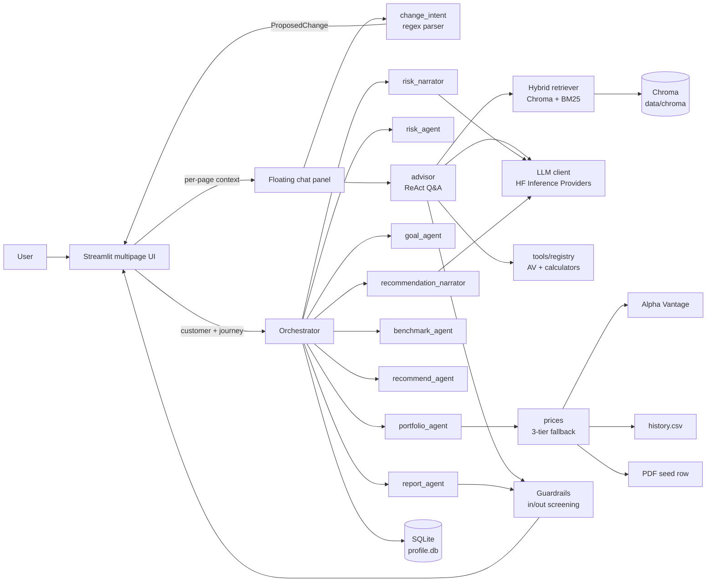
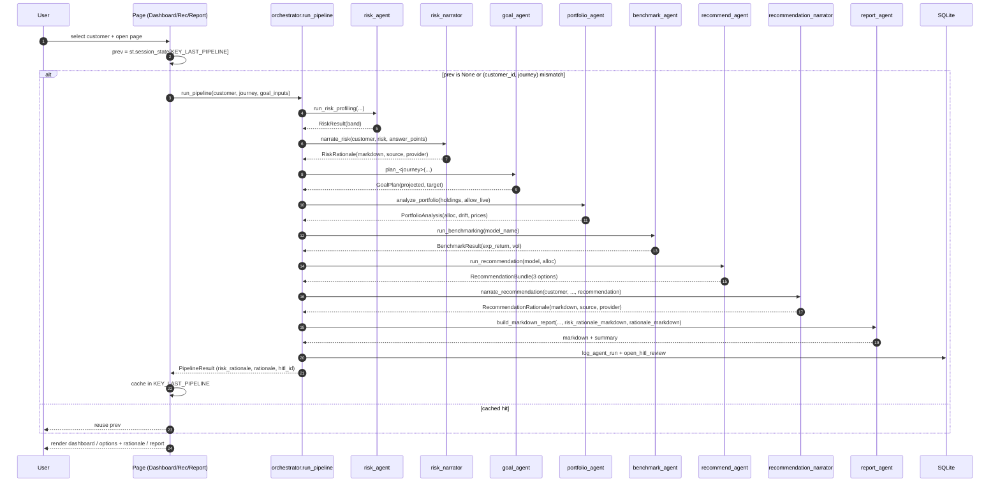
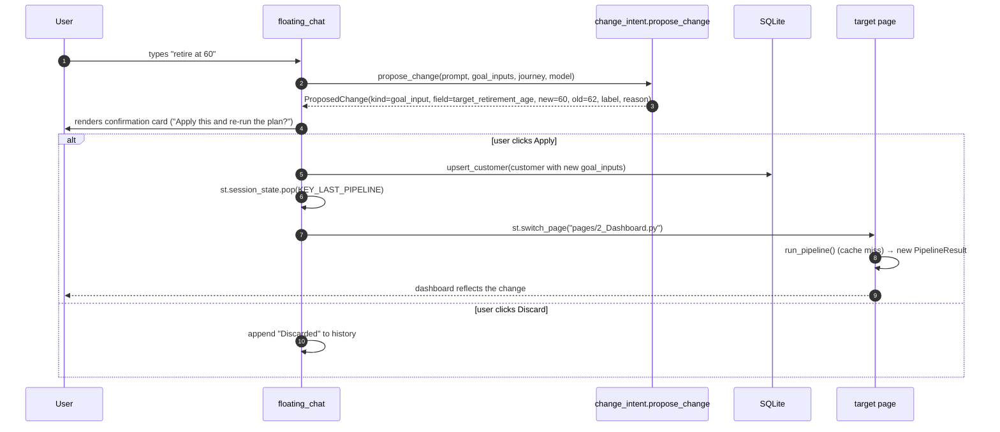
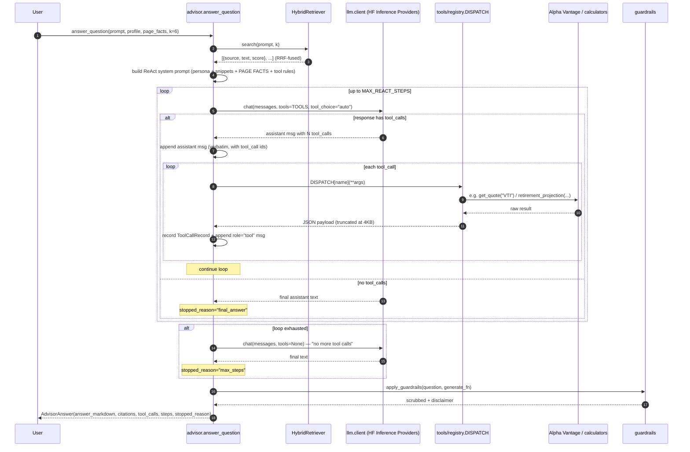
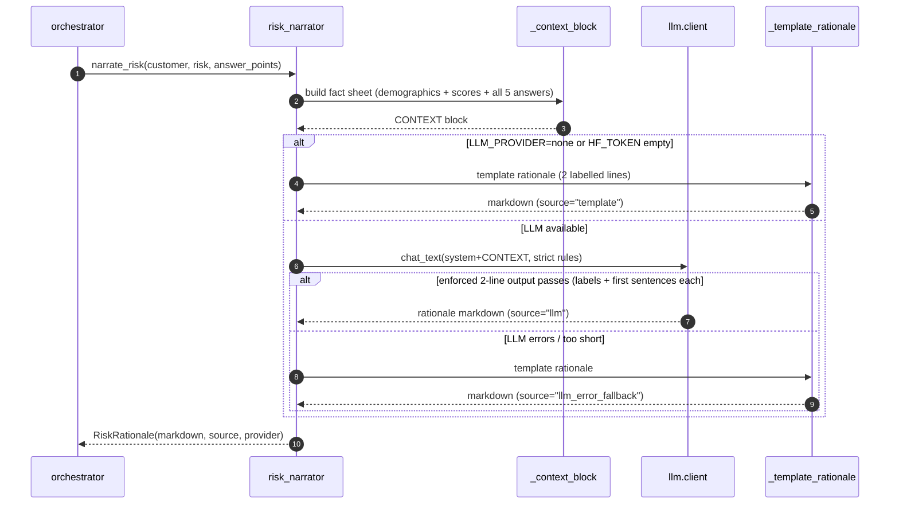
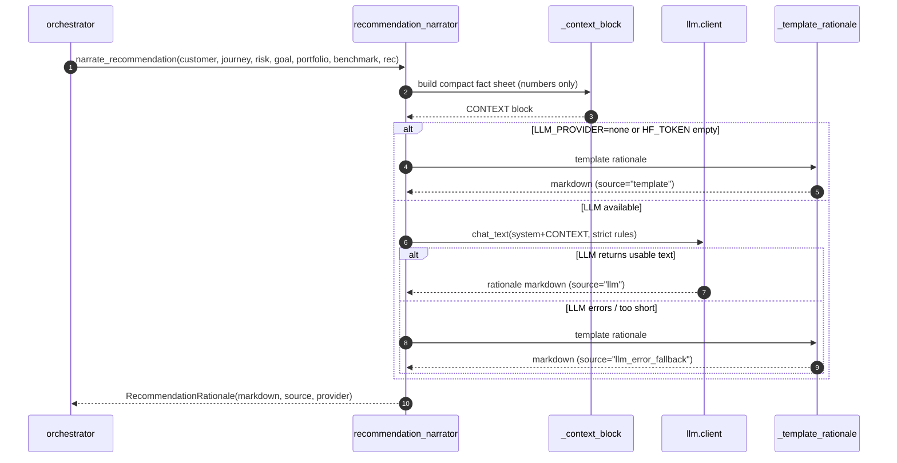
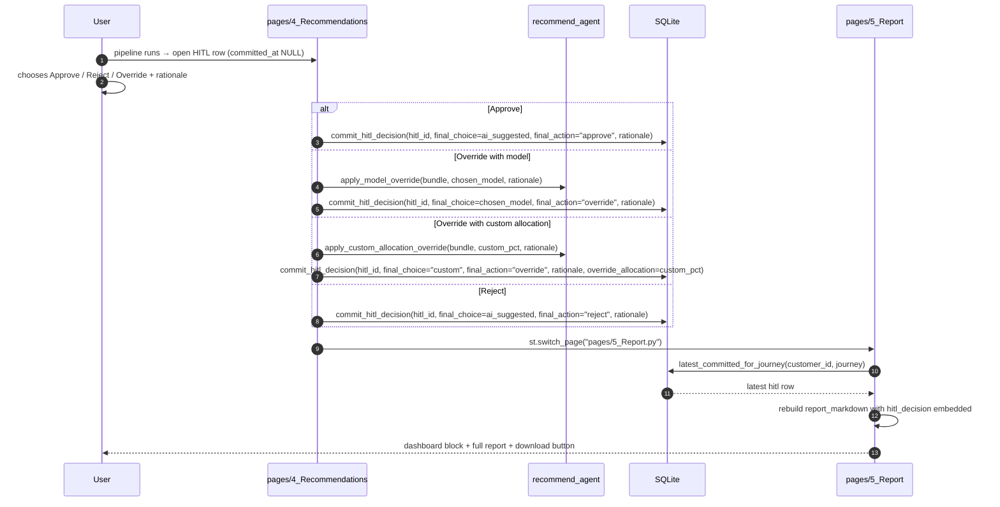
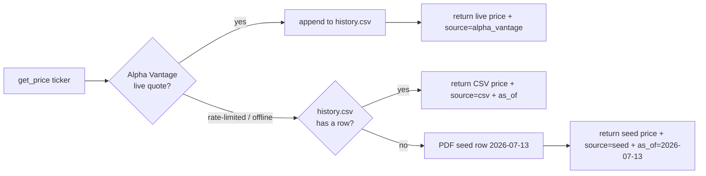
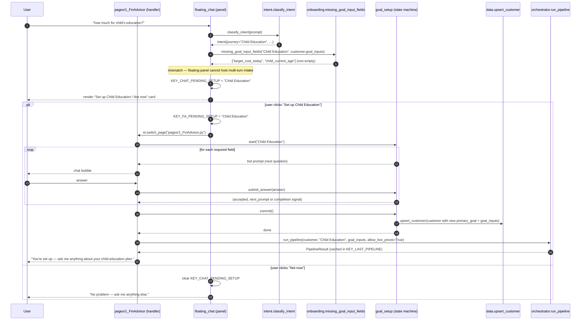
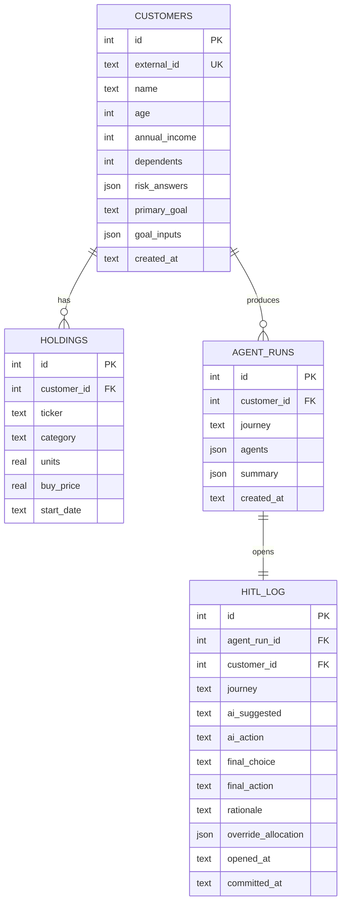

# NexWealth AI — Architecture

**Product:** *FinAdvisor* — an AI-native wealth-management experience delivered as a
Streamlit multipage app with a docked chat panel that grounds every answer in the
current page's context and can drive structured changes to the underlying plan.

This document describes the system as it exists in the repo today: layers, files,
data flow, and how the pieces stitch together. Read it top-to-bottom for a full
walkthrough or jump to the section you need.

- [1. High-level architecture](#1-high-level-architecture)
- [2. Layered view](#2-layered-view)
- [3. Repository structure](#3-repository-structure)
- [4. Component reference](#4-component-reference)
- [5. Flow diagrams](#5-flow-diagrams)
- [6. Data model](#6-data-model)
- [7. Sample-lens journey handling](#7-sample-lens-journey-handling)
- [8. Configuration and secrets](#8-configuration-and-secrets)
- [9. Observability and tests](#9-observability-and-tests)

---

## 1. High-level architecture



**Two entry paths converge in the UI:**

1. **Planning pipeline** — eight chained agents (six deterministic + two grounded LLM
   narrators — one over the risk band, one over the recommendation) produce a full
   recommendation and report for one of three planning journeys (Retirement / Child
   Education / Buy Home).
2. **Grounded Q&A (ReAct)** — the advisor agent runs a Reason → Act → Observe loop
   over 14 tools (Alpha Vantage market data + deterministic financial calculators)
   plus RAG snippets, answering open-ended finance questions with inline citations and
   a tool-call audit trail.

The **floating chat** sits on top of both — it reads the current page's context, decides
whether the user's message is a *change intent* (drives the pipeline) or a *question*
(routes to the advisor), and confirms every change before it lands.

---

## 2. Layered view

```
┌──────────────────────────────────────────────────────────────────┐
│  Presentation                                                    │
│    app/streamlit_app.py           entry, applies theme, bounces  │
│    app/pages/*                    0_Home … 5_Report              │
│    app/components/*               theme, session, charts,        │
│                                   dashboard block, floating chat │
└──────────────────────────────────────────────────────────────────┘
┌──────────────────────────────────────────────────────────────────┐
│  Application (agents)                                            │
│    orchestrator            chains risk → risk-narrate → goal →   │
│                            portfolio → benchmark → recommend →   │
│                            rec-narrate → report                  │
│    intent                  LLM-first / keyword-fallback classifier│
│    change_intent           regex parser for chat-driven edits    │
│    advisor                 ReAct Q&A agent (tools + RAG)         │
│    risk_narrator           grounded LLM rationale over the band  │
│    recommendation_narrator grounded LLM rationale over the bundle│
│    risk / goal / portfolio / benchmark / recommend / report      │
└──────────────────────────────────────────────────────────────────┘
┌──────────────────────────────────────────────────────────────────┐
│  Domain (pure math, no I/O beyond files)                         │
│    calculators, risk, recommend, benchmark, prices, models       │
│    data.py                        SQLite persistence layer       │
└──────────────────────────────────────────────────────────────────┘
┌──────────────────────────────────────────────────────────────────┐
│  Infrastructure                                                  │
│    llm/client, llm/prompts        HF Inference Providers client  │
│    rag/ingest, retrieve, store    Chroma + BM25 hybrid           │
│    tools/alpha_vantage, calculators, registry                    │
│                                   12-tool catalog for ReAct loop │
│    guardrails                     input screen + output scrub    │
│    config                         pydantic Settings (.env)       │
└──────────────────────────────────────────────────────────────────┘
┌──────────────────────────────────────────────────────────────────┐
│  Storage (all under data/)                                       │
│    profile.db          SQLite: customers, holdings, agent_runs,  │
│                        hitl_log                                  │
│    chroma/             Chroma vector store (RAG index)           │
│    prices/history.csv  daily-appended price floor                │
│    raw/av_cache.sqlite Alpha Vantage on-disk request cache       │
│    seed/customers.json 5 hero customers                          │
└──────────────────────────────────────────────────────────────────┘
```

Dependencies flow top-to-bottom only. The domain layer has zero knowledge of Streamlit;
agents don't reach into `st.session_state`; the UI never talks to Chroma or SQLite
directly (it goes through `advisor.domain.data` or the agents).

---

## 3. Repository structure

```
financial-advisor-llm/
├── .env                          # secrets, gitignored (HF_TOKEN, ALPHA_VANTAGE_KEY)
├── .env.example                  # placeholders only, committed
├── .streamlit/config.toml        # NexWealth AI theme + fileWatcherType="poll" (silences transformers/torchvision watcher noise)
├── Makefile                      # setup / index / prices / seed / run / eval / test / clean
├── README.md                     # setup + run guide (start here)
├── ARCHITECTURE.md               # this file
├── PROPOSAL.md                   # capstone proposal
├── MENTOR_SESSIONS.md            # weekly mentor log
├── requirements.txt              # pinned deps
│
├── app/                                       # Streamlit UI
│   ├── streamlit_app.py                       # entry — applies theme, bounces to Home
│   ├── components/
│   │   ├── theme.py                           # apply_theme() + CSS (FAB, docked panel,
│   │   │                                      #   scrollable chat frames)
│   │   ├── session.py                         # KEY_* constants + active_customer()
│   │   │                                      #   (also owns KEY_FA_HISTORY /
│   │   │                                      #   KEY_CHAT_HISTORY reset on customer swap)
│   │   ├── charts.py                          # Plotly primitives (donut, bars, gauge)
│   │   ├── dashboard.py                       # shared dashboard block (Dashboard + Report)
│   │   ├── chat_ui.py                         # shared chat renderer (bubbles + right rail)
│   │   ├── onboarding.py                      # new-user chat-driven intake (goal-aware)
│   │   ├── goal_setup.py                      # mini-onboarding (existing user, new goal)
│   │   └── floating_chat.py                   # FAB + docked chat panel + change flow
│   └── pages/
│       ├── 0_Home.py                          # customer picker + chat onboarding (new users)
│       ├── 1_FinAdvisor.py                    # pure chat + right-side session context rail
│       ├── 2_Dashboard.py                     # per-customer plan view
│       ├── 3_Risk_Profile.py                  # read-only band summary + on-demand rationale
│       ├── 4_Recommendations.py               # 3 options + HITL Approve/Reject/Override
│       └── 5_Report.py                        # dashboard block + downloadable markdown
│
├── src/advisor/                               # application + domain + infra
│   ├── config.py                              # pydantic Settings (.env)
│   ├── guardrails.py                          # input screening + output scrub/disclaimer
│   ├── agents/
│   │   ├── orchestrator.py                    # chains the 8-agent pipeline
│   │   ├── intent.py                          # journey classifier (LLM → keyword)
│   │   ├── change_intent.py                   # regex parser for chat-driven edits
│   │   ├── advisor.py                         # ReAct Q&A agent (tools + RAG)
│   │   ├── risk_agent.py                      # 5-question risk profiling
│   │   ├── risk_narrator.py                   # grounded LLM rationale (2nd step)
│   │   ├── goal_agent.py                      # retirement / education / home planners
│   │   ├── portfolio_agent.py                 # allocation, drift, live prices
│   │   ├── benchmark_agent.py                 # live 5Y CAGR vs proxy ETF (AOM/AOR/AOA)
│   │   ├── recommend_agent.py                 # 3 options + HITL overrides
│   │   ├── recommendation_narrator.py         # grounded LLM rationale (7th step)
│   │   └── report_agent.py                    # markdown report + summary JSON
│   ├── domain/
│   │   ├── data.py                            # SQLite schema + CRUD + HITL log
│   │   ├── models.py                          # ASSET_CLASSES, MODEL_PORTFOLIOS
│   │   ├── prices.py                          # 3-tier fallback pricer
│   │   ├── risk.py                            # RiskResult + banding rules
│   │   ├── calculators.py                     # FV, PMT, education, home
│   │   ├── recommend.py                       # allocation → target %; fit_score
│   │   └── benchmark.py                       # proxy ETF registry + live CAGR/vol from AV weekly closes
│   ├── rag/
│   │   ├── ingest.py                          # chunk corpus/ → Chroma + BM25
│   │   ├── retrieve.py                        # HybridRetriever (RRF-fused)
│   │   └── store.py                           # get_or_create_collection()
│   ├── llm/
│   │   ├── client.py                          # HF Inference Providers wrapper
│   │   └── prompts.py                         # system prompt + DISCLAIMER
│   ├── tools/
│   │   ├── alpha_vantage.py                   # cached AV client (6 tools)
│   │   ├── calculators.py                     # deterministic calculators (5 tools)
│   │   └── registry.py                        # 12-tool OpenAI catalog + DISPATCH
│   └── eval/
│       ├── fpb.py                             # Financial PhraseBank loader
│       └── runner.py                          # 50-sample sentiment eval
│
├── corpus/                                    # RAG source docs (ingested to Chroma)
│   ├── client_portfolio_reference.md
│   ├── glossary.md
│   ├── sec_education/                         # SEC investor.gov materials
│   ├── irs_pubs/                              # IRS Pub 590-A/B etc.
│   └── finra_investor/                        # FINRA investor-education
│
├── data/                                      # runtime state
│   ├── seed/customers.json                    # 5 hero customers (committed)
│   ├── prices/history.csv                     # daily-appended price floor (committed)
│   ├── raw/av_cache.sqlite                    # AV request cache (gitignored)
│   ├── chroma/                                # Chroma vector store (gitignored)
│   └── profile.db                             # SQLite customers/holdings/hitl (gitignored)
│
├── scripts/                                   # one-shot maintenance runners
│   ├── build_rag_index.py                     # (re)build data/chroma from corpus/
│   ├── refresh_prices.py                      # append today's row per ticker
│   ├── prewarm_cache.py                       # warm AV cache before a demo
│   ├── seed_customers.py                      # load customers.json into profile.db
│   ├── fetch_alpha_vantage.py                 # ad-hoc AV pull utility
│   ├── build_mentor_slides.py                 # slide gen for MENTOR_SESSIONS.md
│   └── run_eval.py                            # runs eval/runner.py against FPB
│
└── tests/                                     # pytest suite (40 tests)
    ├── conftest.py
    ├── test_domain.py
    ├── test_guardrails.py
    ├── test_intent.py
    └── test_rag_chunking.py
```

---

## 4. Component reference

### 4.1 Presentation (`app/`)

**`streamlit_app.py`** — the multipage entry. Applies the theme and immediately
`st.switch_page`'s to `pages/0_Home.py`. Ensures both `src/` and the repo root are on
`sys.path`, so `from advisor…` and `from app.components…` both resolve.

**`app/components/theme.py`** — single source of truth for visual styling. Exports:

- `BRAND_NAME = "NexWealth AI"`
- `apply_theme(page_key)` — renders the sidebar (customer chip, in-app nav,
  agent-pipeline block, LLM-status footer) and injects the shared CSS. Returns the
  active `Customer` or `None`.
- `_CSS` — includes rules for the docked chat panel and scrollable chat frames:
  - `.st-key-nw_fab` → `position: fixed; right: 28px; bottom: 28px; z-index: 9999`
  - `.st-key-nw_chat_panel` → `position: fixed; top: 72px; right: 24px; bottom: 24px; width: 440px`
  - `section[data-testid="stMain"]:has(.st-key-nw_chat_panel) div[data-testid="stMainBlockContainer"] { padding-right: 480px }` shifts the page left when the panel is open so nothing is hidden behind it.
  - `.st-key-nw_chat_close` → absolute-positioned in the panel's top-right corner.
  - `.st-key-nw_chat_scroll` (main-page chat) → `max-height: 65vh; overflow-y: auto` — pins the chat history to a fixed frame so a long conversation is scrollable and the input row stays anchored below. `render_history` also injects a small `components.html` snippet after the bubbles that reaches into `window.parent.document`, finds this element, and sets `scrollTop = scrollHeight` so the newest turn is always in view without the user having to scroll. Turn count is folded into the JS so Streamlit hands us a fresh iframe every rerun.
  - `.st-key-nw_chat_scroll_fc` (floating panel chat) → same but `max-height: 50vh` since the panel itself is already a smaller frame.
  - `.nw-chat-user` / `.nw-chat-user-bubble` — user bubble class + inner style: `justify-content: flex-end` on the outer flex row, filled blue bubble (`--nw-blue`) with a right-tail radius on the inner. Renders as a right-aligned chat bubble mirroring standard chat conventions. Bot turns still use `st.chat_message("assistant")` and get a soft card bubble on the left via `[data-testid="stChatMessage"] [data-testid="stChatMessageContent"]`. Chat bubble alignment is decoupled from Streamlit's internal chat DOM (which shifts version to version) — see `chat_ui.py` below.

  Streamlit auto-generates the `st-key-<key>` class on any keyed widget's wrapper —
  this is the hook we exploit to fix-position and size them.

**`app/components/session.py`** — shared session_state keys and helpers:

- `KEY_ACTIVE_CUSTOMER`, `KEY_LAST_PIPELINE`, `KEY_HITL_PENDING`, `KEY_ANSWERED`, `KEY_RISK_RATIONALE`
- `KEY_FA_HISTORY`, `KEY_CHAT_HISTORY` — chat histories are declared here (not in the pages/components that use them) so `set_active_customer()` can reset them alongside the pipeline cache without importing the chat modules (would form an import cycle).
- `set_active_customer(id)` — pops all of the above so a customer swap doesn't leak the previous customer's plan or greeting into the new session.
- `active_customer()` → resolves the sidebar-selected customer from the DB.
- `profile_dict_for_prompt(customer)` → shapes the customer profile as a
  short-form dict the LLM prompt template consumes. Includes the deterministic
  `risk_tolerance` (read from the last `PipelineResult`'s `risk_band`, lower-cased) +
  `goals` + `goal_inputs` so the persona block reflects the real plan shape.

**`app/components/chat_ui.py`** — UI-only shared chat helpers:

- `render_history(history, scroll_key="nw_chat_scroll")` — replays a role/content
  list of chat bubbles inside a keyed container so the CSS scroll frame applies. The
  floating panel passes `scroll_key="nw_chat_scroll_fc"` to pick up the shorter
  variant. Rendering is **per-role**:
  - bot turns → `st.chat_message("assistant")` + `st.markdown(content)` (left-aligned card bubble).
  - user turns → a plain HTML `.nw-chat-user` wrapper with the escaped content in `.nw-chat-user-bubble` (right-aligned blue bubble). User text is passed through `_escape_and_break` — HTML-escaped and `\n` → `<br>` — so raw chat content can't inject markup. Rendering the user bubble ourselves (instead of via `st.chat_message("user")`) decouples alignment from Streamlit's internal chat DOM, which changes across versions.
  - After every replay, a `components.html` block runs `el.scrollTop = el.scrollHeight` against `window.parent.document.querySelector('.st-key-<scroll_key>')` so the newest turn is always in view. Turn count is folded into the JS body to force a fresh iframe on every rerun.
- `render_context_panel(title, intake_label, intake_percent, parameters, api_trace)` —
  the right-side session-context rail (INTAKE PROGRESS bar + CURRENT PARAMETERS list
  + optional API TRACE) used by Home + FinAdvisor.
- `push_bot(history, content)` / `push_user(history, content)` — role-tagged append
  helpers used by every chat surface so the two roles stay consistent.

**`app/components/onboarding.py`** — goal-aware new-user intake. Three phases composed dynamically:

1. **Intro (4 Qs)** — name, age, monthly income (USD), `goal_type` — where `goal_type` classifies into `Retirement Planning`, `Child Education`, or `Buy Home`.
2. **Branch** — journey-specific follow-ups from `_BRANCH` (retire_age + monthly_need for Retirement, child_current_age + target_cost_today for Education, home_price + down_payment_pct + target_purchase_year for Buy Home).
3. **Tail (3 Qs)** — savings (freetext + parsed dollar amount if present), health, `risk_confirm` (4 options: hold / partial / move / **buy more** — the last one added because without it a new user's tolerance couldn't cross the Aggressive threshold; see §7-note below).

`_current_questions()` reads the *current* `goal_type` from state and composes the active list on every rerun — the total-question count grows once the user picks a goal, and `step` stays a simple int index into the composed list.

**Currency — USD-only.** The app targets the US market. `_extract_money` recognises only `k` / `m` suffixes and a `$` prefix — no `lakh` / `crore` / `₹` (a prior version accepted those, which caused a home-price answer of `25 Cr` to be stored as $250M and produce a $144M target future value). `_display_money` always renders `$X,XXX`. Question prompts and error messages exclusively cite USD examples; the tail `savings` question mentions 401(k) / IRA / brokerage (not EPF); `risk_confirm` option (c) is "high-yield savings or Treasury bills" (not "fixed deposits"). `_classify_risk_confirm` maps a/b/c/d → 5-element `answer_points` arrays fed into `compute_risk`: `d=[3,3,3,3,3]` (Aggressive), `a=[2]*5` (Growth-ish), `b=[1]*5` (Moderate), `c=[0]*5` (Moderate). Without option (d) — the fix to a real defect — a new user's max composite score capped at ~67 and Aggressive was unreachable.

Answer extraction is entirely regex — no LLM required for onboarding so it always works even when `LLM_PROVIDER=none`:

- `_extract_name` strips common lead-ins ("I am", "I'm", "My name is", "Hi, I am", "It's", "Call me", "This is") **then keeps only the leading 1-4 capitalised proper-noun tokens** (via `_NAME_TOKEN_RE`) so a message like `"I am Peter Parker, 35 year old male."` yields `Peter Parker`, not the whole sentence. Lowercase input (`"peter parker"`) is auto-title-cased first so the token regex still catches it.
- `_extract_money` parses `80000`, `80,000`, `$5,000`, `5k`, `1.2m` (USD).
- `_extract_money_from_freetext` — looser variant that scans a sentence for a dollar-marked or `k`/`m`-suffixed value. Used to pull a numeric `current_savings` out of the tail `savings` freetext (`"I have $100,000 in a brokerage"` → `100000`); falls back to per-journey defaults if no number is present.
- `_extract_year` accepts absolute (`2029`) or relative (`in 4 years`, `4`).
- `_extract_goal` maps `"1"/"2"/"3"` or free-text keywords into the three journey labels.

**Opportunistic multi-field pickup.** A user is not forced to answer one field per turn. `_sniff_field(key, raw)` looks at any answer and returns a value for `key` **only when the surrounding text contains a context word for that field** — this is the piece that lets one message fill several turns at once without misclassifying unrelated numbers:

| Field | Context words required |
|---|---|
| `age` | `years old` / `yo` / `y/o` / `year-old` |
| `income` | `month` / `salary` / `earn` / `take-home` / `paycheck` |
| `retire_age` | `retire` / `retirement` / `pension` (extra shape: `retire at 60`) |
| `monthly_need` | `retire`… (**and** the money value must appear *after* the retirement word, so a stated current income isn't mis-labelled as retirement need) |
| `home_price` | `home` / `house` / `property` / `apartment` / `condo` |
| `down_payment_pct` | `down` / `downpayment` + `%` |
| `target_purchase_year` | `20xx` or `in N years` |
| `child_current_age` | `child` / `kid` / `son` / `daughter` |
| `target_cost_today` | `college` / `tuition` / `education` |
| `goal_type` | any goal keyword (reuses `_extract_goal`) |

Freetext fields (`savings`, `health`, `risk_confirm`) are intentionally absent from the sniffer table — they must be answered by their own turn.

`_opportunistic_sweep(current_key, raw, state)` runs after every successful primary answer and calls `_sniff_field` for every remaining question in the currently-composed list (intro + branch + tail). Non-None hits are written into state, then `_advance_past_prefilled` skips forward past every question whose key is already filled. So a first-turn reply like `"I am Peter Parker, 35, I make $8,000/month and want to retire at 60 on $6k/month"` populates `name`, `age`, `income`, `goal_type=Retirement Planning`, `retire_age=60`, `monthly_need=$6k` in one shot — the bot jumps straight from question 1 to the tail questions.

**Noise tolerance.** `submit_answer` tries the strict extractor first; if that returns None, it falls back to `_sniff_field(q.key, raw)` so a noisy answer like `"she's 5 by the way, starting kindergarten next year"` is still accepted for the child-age question. Strict extractors (`_extract_int`, `_extract_money`, `_extract_year`) also grab the *first* plausible token, which already handles the common "irrelevant text around a clean number" case.

Public helpers exposed for the mismatch guard + mini-onboarding flow:

- `REQUIRED_GOAL_INPUTS: dict[journey, tuple[key, ...]]` — the required keys per journey.
- `missing_goal_input_fields(journey, goal_inputs) → list[str]` — the required keys not yet present. Used by both chat surfaces to detect a mismatch between a user's question and their actual `goal_inputs` shape.
- `branch_questions(journey) → list[OnboardQ]` — exposes the branch-only prompt list so `goal_setup` can reuse the exact same wording and extractors as the full onboarding.

**`app/components/goal_setup.py`** — mini-onboarding for an **existing** customer adding a new goal. When someone with a Retirement profile asks about buying a home, the chat handler offers to walk through only the branch questions (`home_price` / `down_payment_pct` / `target_purchase_year`) instead of the full 8-Q flow.

- State keyed by `KEY_GS_JOURNEY` / `KEY_GS_STATE` / `KEY_GS_STEP`.
- `start(journey) → first_prompt` / `submit_answer(raw) → (accepted, message, complete)` / `commit(customer)` / `cancel()` / `is_active()` / `active_journey()`.
- `commit(customer)` merges the collected branch fields into `customer.goal_inputs` (with sensible defaults for the tail-only fields — `current_savings`, `monthly_contribution`/`monthly_saving_capacity`), sets `customer.primary_goal = journey`, calls `upsert_customer`, pops `KEY_LAST_PIPELINE` so the next render reruns the pipeline against the new goal shape, and calls `cancel()`.

**`app/components/charts.py`** — Plotly building blocks used by the dashboard block:
projection line, allocation donut, current-vs-target bars, risk gauge.

**`app/components/dashboard.py`** — `render(customer, pipeline_result)` — the shared
dashboard block reused by both **Dashboard** and **Report** pages.

**`app/components/floating_chat.py`** — the docked chat. Two states:

- **Closed** — a keyed container (`key="nw_fab"`) holds a single "💬 Ask FinAdvisor"
  button; CSS fixes it to bottom-right. Setting `KEY_CHAT_OPEN=True` and `st.rerun()`
  opens the panel.
- **Open** — a keyed bordered container (`key="nw_chat_panel"`) renders the panel;
  CSS fixes it to the right side of the viewport. Inside: header, "What I can see"
  expander (dumps `page_context`), scroll-framed chat history (`nw_chat_scroll_fc`),
  pending-confirmation card (if a change is queued), pending-goal-setup card (if a
  mismatch was detected), `st.chat_input`, footer buttons.

The panel is grounded via a `page_context: dict` each page passes in. Every user turn
is routed in order:

1. `propose_change(prompt, ...)` — if a change intent matches, render a
   confirmation card. On Apply, `_commit_change()` mutates the customer via
   `upsert_customer`, pops the cached pipeline, and switches to the most relevant page.
2. `classify_intent(prompt)` — if `OUT_OF_SCOPE`, echo `OUT_OF_SCOPE_MESSAGE`.
3. **Mismatch guard** — if the intent classifier picked a planning journey and
   `missing_goal_input_fields(intent.journey, customer.goal_inputs)` is non-empty,
   stash the target journey in `KEY_CHAT_PENDING_SETUP` and render a "Set up X /
   Not now" card. Because the panel closes on `st.switch_page`, "Set up X" writes
   the target journey into `KEY_FA_PENDING_SETUP` (the full-page FinAdvisor's session
   key) and redirects to `pages/1_FinAdvisor.py` — the full-page chat then owns the
   multi-turn mini-onboarding flow.
4. Fall through to `answer_question()` (grounded ReAct or grounded fallback).

The chat renders on every page **except** `1_FinAdvisor` (that page *is* the chat).

**Pages (`app/pages/`)**

| Page | Purpose |
|---|---|
| `0_Home.py` | Two-mode surface: **Existing** — search + selectbox of seeded customers + Load. **New** — chat-driven onboarding (`components/onboarding.py`). The hero title is derived dynamically from `onboard_state["goal_type"]` — it reads "Financial planning — new user onboarding" until the user answers the goal question, then flips to "Retirement Planning" / "Child Education" / "Buy Home", so we never imply a bias toward one journey. On completion, runs the pipeline via `commit_customer_and_run` + `run_pipeline` and renders inline metric tiles + priority recommendations before the user opens the Dashboard. The one-time commit is gated by a per-onboarding `KEY_ONBOARD_COMMITTED_ID` flag (not the pipeline cache) so a stale `KEY_LAST_PIPELINE` from a prior existing-user session doesn't skip the commit. |
| `1_FinAdvisor.py` | Pure chat + right-side session-context rail. Lazily runs `run_pipeline` on load if the active customer has a `primary_goal` + `goal_inputs` but the cached `KEY_LAST_PIPELINE` is missing or belongs to a different customer/journey — this populates the PAGE FACTS dict fed to the ReAct advisor. Handler routes: mini-onboarding turn (if `goal_setup.is_active()`) → `propose_change` → `OUT_OF_SCOPE` → mismatch guard → `answer_question`. Hero title derives from `customer.primary_goal` (no more hardcoded "Retirement planning"). |
| `2_Dashboard.py` | For the active customer: risk band, goal projection, allocation, benchmark, holdings, HITL log. Runs the pipeline if not cached. |
| `3_Risk_Profile.py` | **Read-only** band summary + on-demand rationale. The 5-question questionnaire and goal-inputs form are gone — risk is inferred from the single `risk_confirm` question during onboarding, and goal inputs are edited via the FinAdvisor chat. Renders the deterministic band from the customer's stored `risk_answers` plus an "Explain this band" button that pulls the grounded LLM rationale from `narrate_risk` (source badge `llm` / `template` / `llm_error_fallback`). |
| `4_Recommendations.py` | 3 investment options centered on the AI-suggested risk band, with the grounded LLM rationale rendered above the option cards (source badge indicates `llm` / `template` / `llm_error_fallback`). HITL: Approve / Reject / Override (different model or custom allocation). Commits the HITL row. |
| `5_Report.py` | Dashboard block + full markdown report; downloadable `.md`. Refreshes markdown if a HITL decision was committed after the pipeline ran. |

Each planning page calls `render_floating_chat(page_key, page_context, customer)` at
the very end with a page-specific `page_context` dict — that's what the chat sees.

### 4.2 Application (`src/advisor/agents/`)

**`orchestrator.py`** — the planning pipeline. `run_pipeline(customer, journey, goal_inputs, allow_live_prices)` runs:

1. `run_risk_profiling(answers, age, income, dependents)` → `RiskResult`
2. `narrate_risk(customer, risk, answer_points)` → `RiskRationale(markdown, source,
   provider)` — a grounded LLM explanation of *why* this customer landed in this
   band. Emits exactly two labelled lines (**Why this band:** … and **What the
   band means for the plan:** …). Falls back to a deterministic 2-line template
   when `LLM_PROVIDER=none`, `HF_TOKEN` is empty, or the LLM errors.
3. `_run_goal(journey, customer, goal_inputs, risk_band)` — dispatches to
   `plan_retirement` / `plan_child_education` / `plan_buy_home`. Raises
   `ValueError` for `"Financial Q&A"` (the sample-lens fallback in the UI is what
   prevents this from ever being hit — see §7).
4. `analyze_portfolio(holdings, allow_live=...)` → `PortfolioAnalysis` (current
   allocation %, drift vs target, live prices via 3-tier fallback).
5. `run_benchmarking(model_name)` → expected return / volatility for the model
   portfolio.
6. `run_recommendation(model_name, allocation_pct)` → 3 options
   (`RecommendationBundle`) centered on the AI-suggested model.
7. `narrate_recommendation(customer, journey, risk, goal, portfolio, benchmark,
   recommendation)` → `RecommendationRationale(markdown, source, provider)` — a
   grounded LLM paragraph over the finished bundle. Falls back to a deterministic
   template when `LLM_PROVIDER=none`, `HF_TOKEN` is empty, or the LLM errors.
8. `build_markdown_report(..., risk_rationale_markdown=risk_rationale.markdown,
   rationale_markdown=rationale.markdown)` → the full report + guardrail scrub.

Persists via `log_agent_run` (summary JSON, including `risk_rationale.source` +
`rationale.source` + `provider` fields for observability) and opens a **Shape-B
HITL row** in `open_hitl_review` (`committed_at IS NULL`). Returns a
`PipelineResult` that also carries `risk_rationale: RiskRationale` and
`rationale: RecommendationRationale` so the Risk Profile / Recommendations pages
can render the two narrations independently and the Report page can re-embed them
after a HITL commit.

**`intent.py`** — journey classifier. Tries the LLM first with a fixed 4-label prompt
(`Retirement Planning`, `Child Education`, `Buy Home`, `Financial Q&A`). Falls back
to keyword rules if the LLM's answer is off-menu, the LLM call fails, or
`settings.llm_provider == "none"`.

**`change_intent.py`** — the chat's regex-based intent parser. `propose_change(prompt, goal_inputs, current_journey, current_model)` recognizes a fixed vocabulary:

- `monthly_contribution` — "raise my monthly contribution to $1,500"
- `target_retirement_age` — "retire at 60"
- `home_price` — "target a $900k home"
- `target_cost_today` — "budget $200k for college"
- `journey` — "plan for buying a home", "switch to retirement planning"
- `model` — "use the Aggressive model"

Returns a `ProposedChange(kind, field, new_value, old_value, label, reason)` or
`None`. The floating chat uses `None` as the signal to fall through to Q&A.

Deliberately **not** an LLM call — the chat still works when `LLM_PROVIDER=none`.

**`advisor.py`** — the ReAct Q&A path. `answer_question(prompt, profile, page_facts, k=6)` runs a
Reason → Act → Observe loop:

1. **Retrieve** — `HybridRetriever.search(prompt, k)` returns top-k RAG snippets
   (BM25 + Chroma dense, RRF-fused). Those are embedded in the system prompt as
   grounded context.
2. **Prompt** — `_react_system_prompt(profile, page_facts, rag_block)` extends
   `build_system_prompt` (persona + retrieved context) with ReAct-specific
   instructions: *call a tool rather than guess a number, chain tool calls when
   needed, cite `[Tool: <name>]` inline*. The `page_facts` dict (the numbers
   already on the user's screen) is embedded verbatim under a `## PAGE FACTS`
   heading so the LLM is told to prefer those over recomputation.
3. **Loop** — up to `MAX_REACT_STEPS = 6` iterations. Each iteration calls
   `llm.client.chat(messages, tools=TOOLS)`. If the response has `tool_calls`, we
   dispatch each via `DISPATCH` in `tools/registry.py`, capture a
   `ToolCallRecord(name, args, result_preview, ok, error)`, and append the tool
   result as a `role="tool"` message. If the response has no `tool_calls`, that's
   the final answer.
4. **Cap** — if the loop hits `MAX_REACT_STEPS` without a final answer, we send one
   more request with `tools=None` and a message instructing the LLM to answer with
   what it has. `stopped_reason` becomes `"max_steps"`.
5. **Guardrails** — the final text goes through `apply_guardrails(question, _generate)`
   (input screen + directive scrub + disclaimer).

Returns `AdvisorAnswer(answer_markdown, citations, tool_calls, follow_up,
was_blocked, provider, steps, stopped_reason)`. Both chat surfaces (the
`1_FinAdvisor` page and the docked panel) render the `tool_calls` list in an
expander so the user can see what the agent consulted.

**Grounded fallback** — when `LLM_PROVIDER=none`, `HF_TOKEN` is empty, or the LLM
turn errors after retries, `_fallback_answer(question, snippets, profile, page_facts, reason)`
returns a fully-formed markdown reply grounded in the user's plan rather than a
generic snippet echo:

- `_fallback_banner(reason)` prepends a small italicised note explaining
  *why* the LLM is out of the loop. For `no_llm` it says the provider is
  disabled; for `llm_error` it pulls the classified reason from
  `advisor.llm.client.last_error()` and splices it into the banner
  (e.g. *"LLM unavailable — HF token rejected (401) — check HF_TOKEN in .env.
  Showing grounded numbers…"*). The classification lives in
  `_classify_error(exc)` in `llm/client.py` and maps 401/402/403/404/429/
  timeout/connection failures to human labels — every failed `chat()` call
  sets `_last_error` before re-raising, and a subsequent successful call
  clears it, so the banner reason always tracks the most recent state.
  The banner sets user expectations without hiding the mode from them, and
  gives the operator enough signal to distinguish "credits exhausted" from
  "wrong model route" from "typo in the .env token" without reading logs.
- `_format_plan_lines(page_facts)` pulls the numbers that are already on the
  user's screen (goal-plan target, monthly SIP, success probability, current
  allocation, benchmark CAGR) and renders them as `• Label: value` bullets.
- `_format_profile_lines(profile)` adds the customer's own inputs (age, income,
  risk band, journey, filled goal inputs) as a second bullet block — this gives
  the reply a specific, grounded framing even when the plan snapshot is missing
  (e.g. onboarding-just-completed with no cached pipeline yet).
- The top-3 RAG snippets are appended at the bottom as *reference reading*, not
  as the answer body — so the reply always leads with the user's own plan
  numbers, and citations remain visible for follow-up.

`stopped_reason` remains `"no_llm"` or `"llm_error"` for observability so the
report + agent-runs summary can still distinguish "the LLM was intentionally
disabled" from "the LLM call failed at inference time".

This was rebuilt in response to a demo-day failure mode: the HuggingFace
Inference Providers monthly credit ran out mid-session, every ReAct call
returned 402, and the old fallback echoed unrelated IRS RAG snippets for a
question like *"how much should I set aside for my child's education?"* — the
customer's own goal plan was ignored. The grounded fallback now surfaces that
plan even when the LLM path is dead.

The 14 tools registered in `tools/registry.py`:

| Category | Tools |
|---|---|
| Market data (Alpha Vantage, cached) | `get_stock_quote`, `get_company_overview`, `get_news_sentiment`, `get_technical_indicator`, `get_sector_performance`, `get_fx_rate` |
| Calculators (deterministic) | `retirement_projection`, `plan_retirement`, `plan_education`, `plan_home`, `savings_goal`, `asset_allocation`, `debt_payoff`, `emergency_fund` |

Tool results are JSON-serialised and truncated at 4KB before being fed back to the
model so the context window doesn't blow up on `get_news_sentiment` or a technical
indicator series.

**Journey planners are three separate tools, not one.** Previously we exposed a
single `plan_journey(journey, risk_band, inputs)` with `inputs` typed as a bare
`object` — the LLM freely invented values inside that dict (e.g. bumping
`monthly_contribution` from 700 to 1000, or replacing the customer's
$180k `target_cost_today` with a $430k guess) because the JSON Schema didn't
declare the fields. The three replacements (`plan_retirement`,
`plan_education`, `plan_home`) each have explicit typed `properties` and a
`required` list, so the tool call fails validation if the LLM tries to omit
or hallucinate a field. Combined with the "**Goal inputs (use verbatim)**"
line in PAGE FACTS and the plan-lookup rule in the ReAct system prompt, this
closes the loop where the chat was reporting numbers that disagreed with the
Goal Plan tab for the same customer.

**`risk_narrator.py`** — grounded LLM rationale layered over the finished
`RiskResult`. `narrate_risk(customer, risk, answer_points)` returns
`RiskRationale(markdown, source, provider)`.

- `_context_block(...)` builds a compact fact sheet — customer demographics
  (age, income, dependents), the deterministic scores (`tolerance`, `capacity`,
  `risk_score`, `risk_band`), the band description from the domain rulebook,
  and every questionnaire answer paired with its 0-3 point value and
  human-readable label. The scoring rule itself (`0.6·tolerance + 0.4·capacity`)
  is included as reference so the LLM can *narrate* it but never *re-compute* it.
- `_llm_rationale(...)` calls `chat_text` with strict rules: *emit exactly
  two labelled lines, one sentence each, no paragraphs, no bullets, only use
  numbers from CONTEXT, do not propose a different band, non-directive*. The
  two required line labels are `**Why this band:**` and `**What the band
  means for the plan:**`. `max_tokens=30` caps the response so the LLM
  cannot ramble.
- `_enforce_two_lines(...)` is a deterministic post-processor that splits
  the LLM output on the two required labels and keeps only the *first
  sentence* under each — so even if the model ignores the "one sentence"
  instruction, the rendered output is guaranteed to be two short lines.
  Malformed / truncated outputs (missing a label, empty section) fall
  through to the template. A 20-char length floor on the trimmed result
  protects against near-empty responses.
- `_template_rationale(...)` is the deterministic fallback — the same two
  labelled lines built from the tolerance / capacity / score values plus
  the questionnaire lean and demographic drivers (horizon, income,
  dependents) that produced them.
- The dataclass carries `source` (`"llm"` / `"template"` / `"llm_error_fallback"`)
  so the UI can badge how the lines were produced, and `provider` so the
  observability trail in `agent_runs.summary["risk_rationale"]` records which
  HF-Inference-Providers route served the turn.

The Risk Profile page renders this on demand behind an "Explain this band"
button, caches the result by `(customer_id, tuple(answers))`, and invalidates
the cache when the questionnaire answers change. The Report page embeds the
markdown under a "### Why this band" heading inside the "## Risk Profile"
section.

**`recommendation_narrator.py`** — grounded LLM rationale layered over the finished
`RecommendationBundle`. `narrate_recommendation(customer, journey, risk, goal,
portfolio, benchmark, recommendation)` returns `RecommendationRationale(markdown,
source, provider)`.

- `_context_block(...)` builds a compact fact sheet (customer, journey, risk band,
  goal, current allocation, active model, benchmark, AI-suggested target) that the
  LLM must ground its rationale in.
- `_llm_rationale(...)` calls `chat_text` with strict rules: *only use numbers from
  CONTEXT, no invented allocations, non-directive*. Short outputs (< 60 chars) fall
  through to the template so we never render an empty rationale.
- `_template_rationale(...)` is the deterministic fallback — a three-paragraph
  markdown block ("Why {model} fits {customer}", "What to watch", "How to run the
  plan") stitched from the same fact sheet.
- The dataclass carries `source` (`"llm"` / `"template"` / `"llm_error_fallback"`)
  so the UI can badge how the paragraph was produced, and `provider` so the
  observability trail in `agent_runs.summary` records which HF-Inference-Providers
  route served the turn.

**`risk_agent.py`** — deterministic scoring of the 5-question questionnaire +
capacity adjustments (age, income, dependents) → `RiskResult(risk_score,
risk_band, capacity_notes)`.

**`goal_agent.py`** — three pure-math planners returning `GoalPlan`:

- `plan_retirement(current_age, target_age, desired_monthly_income, current_savings, monthly_contribution, risk_band)` — 25× annual income; CPI 3%; risk-band-anchored expected return.
- `plan_child_education(child_current_age, target_cost_today, current_savings, monthly_contribution, risk_band)` — target inflated at CPI + 2% education premium.
- `plan_buy_home(home_price, down_payment_pct, current_year, target_year, current_savings, monthly_saving_capacity)` — down-payment target; return capped at 4.5% for horizons ≤ 5 years.

Each `GoalPlan` carries the classic numbers (`target_amount_future`,
`projected_amount`, `funding_gap`, `required_monthly_sip`, `success_prob`)
plus a richer, more honest set of metrics for the UI to lead with:

- `funding_ratio = projected / target` — distribution-free, intuitive ("79%
  funded" reads correctly whether volatility assumptions are aggressive or
  meek). Always the primary headline on the Dashboard.
- `p10`, `p50`, `p90` — deciles of terminal wealth from a **2000-path
  Monte-Carlo simulation** (`domain.calculators.monte_carlo_terminal_wealth`)
  with monthly log-returns drawn from `N(μ_m, σ_m²)` where
  `μ_m = ln(1+r)/12` and `σ_m = vol/√12`. Seeded (default 42) for
  reproducibility; runs in ~10ms.
- `outlook` — a categorical label ("On track" / "Uncertain" / "At risk")
  from `outlook_band(funding_ratio, success_prob)`. Bands are calibrated so
  a 95%-funded plan reads as *Uncertain*, not *At risk*, even if the point
  probability is thin.

The old `success_prob` is still computed and shown but is now labelled
*"illustrative"* in every UI surface. Two reasons: (1) the previous formula
used *annual* volatility as the *terminal* std, giving nonsensically low
probabilities on 15-year plans that were only 20% short; (2) even after
being fixed to a log-normal with `σ · √years`, collapsing a full terminal
distribution to one number swings hard around the target. Users read
"0.5%" as *doomed* when the plan is 79% funded. The funding ratio + MC
band + outlook combo gives them a fairer signal.

**`portfolio_agent.py`** — `analyze_portfolio(holdings, allow_live)`:
market values via `domain.prices.get_price` (3-tier fallback), current-vs-target
allocation %, drift (`|current − target|`), and per-holding price freshness metadata.
Returns `PortfolioAnalysis`.

**`benchmark_agent.py`** — thin wrapper over `domain.benchmark.run_benchmarking`.
Compares the active model's forward-looking expected return against a live 5Y
realized CAGR of a peer ETF proxy (AOM/AOR/AOA), falling back to an
illustrative reference constant when the live series is unavailable.
`allow_live` propagates from `run_pipeline` so demo mode without network still
renders. See §4.3 `domain/benchmark.py` for the mechanics.

**`recommend_agent.py`** — `run_recommendation(ai_suggested_model, current_allocation_pct)` returns `RecommendationBundle`:

- 3 `RecommendationOption`s centered on the AI-suggested band
  (Moderate → Growth → Aggressive), each with target allocation, expected return,
  volatility, `fit_score` (100 − ½·Σ|current − target|), and rebalancing actions.
- Handles model-override and custom-allocation override via
  `apply_model_override` / `apply_custom_allocation_override`.

**`report_agent.py`** — `build_markdown_report(...)` composes the final markdown
(Risk Profile, Goal Plan, Portfolio, Benchmark, Recommendation, HITL Decision Log)
and passes the emission through `apply_guardrails` for the disclaimer and scrub.

### 4.3 Domain (`src/advisor/domain/`)

**`data.py`** — SQLite persistence. Schema (Shape B for HITL — one row per pipeline
run, updated in place on commit):

- `customers(id, external_id UNIQUE, name, age, annual_income, dependents, risk_answers JSON, primary_goal, goal_inputs JSON, created_at)`
- `holdings(id, customer_id, ticker, category, units, buy_price, start_date)`
- `agent_runs(id, customer_id, journey, agents JSON, summary JSON, created_at)`
- `hitl_log(id, agent_run_id, customer_id, journey, ai_suggested, ai_action, final_choice, final_action, rationale, override_allocation JSON, opened_at, committed_at)`

Public API:

- `init_db()`, `upsert_customer(customer)`, `get_customer(id)`, `list_customers()`
- `log_agent_run(customer_id, journey, agents, summary) → agent_run_id`
- `open_hitl_review(agent_run_id, customer_id, journey, ai_suggested) → hitl_id`
- `commit_hitl_decision(hitl_id, final_choice, final_action, rationale, override_allocation=None)`
- `latest_committed_for_journey(customer_id, journey) → dict | None` — what the
  Report page reads to render the audit trail.

**`models.py`** — `ASSET_CLASSES = ["US Equity", "International Equity", "Fixed Income", "Cash", "Alternative"]`, `MODEL_PORTFOLIOS` (Conservative / Balanced / Moderate / Growth / Aggressive → target % per asset class), ticker → asset-class map.

**`prices.py`** — the 3-tier fallback pricer:

1. Alpha Vantage `GLOBAL_QUOTE` (live).
2. `data/prices/history.csv` (most-recent row).
3. PDF seed row (dated 2026-07-13) — absolute floor so nothing ever renders empty.

Returns `(price, source, as_of)` so the UI can badge freshness.

**`risk.py`, `calculators.py`, `recommend.py`** — pure math, no I/O.
Fully unit-testable; see `tests/test_domain.py`.

**`benchmark.py`** — proxy-ETF benchmarking with a live path. Each risk band
maps to one iShares Core Allocation ETF whose Morningstar Target Risk category
matches by construction:

| Risk band | Proxy | ETF | Why this proxy |
|---|---|---|---|
| Moderate | AOM | iShares Core Moderate Allocation | ~40% equity / ~60% bonds; Moderate Target Risk peer |
| Growth | AOR | iShares Core Growth Allocation | ~60% equity / ~40% bonds; Growth Target Risk peer |
| Aggressive | AOA | iShares Core Aggressive Allocation | ~80% equity / ~20% bonds; Aggressive Target Risk peer |

`run_benchmarking(model_name, *, allow_live=True)` pulls ~5Y of weekly closes
via `alpha_vantage.get_weekly_series` (24h cached in a dedicated
`av_series_cache.sqlite` so daily-series pulls don't evict live quotes),
computes:

- **CAGR** = `(end / start)^(1/years) − 1` over the trailing window
- **annualized vol** = `stdev(log_returns) · √52`

Falls back to `BenchmarkProxy.illustrative_return` (6.5% / 8.5% / 10.0%) on
any AV failure, "premium-gated" response (AV free tier no longer serves
`TIME_SERIES_DAILY?outputsize=full` — hence weekly), or series shorter than
52 observations. `BenchmarkResult` carries `benchmark_source`
(`"live_5y" | "illustrative_fallback"`) and `benchmark_series_weeks` so the
Dashboard and Report can badge which path served the number.

Caveat surfaced in the Report: weekly closes are price-only (no dividend
adjustment), so the live CAGR understates AOM/AOR/AOA total return by ~2pp.
Directional comparison to the portfolio's expected return remains valid.

`domain/calculators.py` grew a few new primitives to back the honest-metrics
overhaul: `funding_ratio(projected, target)`, `outlook_band(fr, prob)`, and
`monte_carlo_terminal_wealth(...)` (2000 paths of monthly log-returns, uses
Box-Muller so no numpy dependency, deterministic under a fixed seed). The
existing `success_probability` gained a `years` parameter — the log-std now
scales as `σ · √years` instead of using annual σ as terminal σ.

### 4.4 Infrastructure

**`llm/client.py`** — thin wrapper around Hugging Face Inference Providers
(`huggingface_hub.InferenceClient`), reads `settings.llm_provider`,
`settings.llm_model_id`. Returns raw text; retries on transient errors.
`LLM_PROVIDER=none` short-circuits — no client is instantiated.

Two staleness bugs that used to require a Python process restart to clear are
now fixed in place:

- **`.env` freezing.** `pydantic-settings` reads env + `.env` at *instantiation*,
  so the module-level `settings = Settings()` snapshot never sees edits made to
  `.env` while the app is running. `get_client()` and `chat()` now call
  `_refresh_settings()` (a fresh `Settings()` per call) and prefer
  `os.environ.get(...)` over the settings object — so rotating `HF_TOKEN`,
  `LLM_PROVIDER`, or `LLM_MODEL_ID` in `.env` takes effect on the next chat
  turn without restarting Streamlit.
- **`InferenceClient` singleton.** The old client was cached on first use, so
  even after `.env` was re-read, the underlying client kept using the original
  token. The cache is now keyed on `(provider, model, token)`; any change
  rebuilds the client. Token fingerprinting for logs uses `_fingerprint(token)`
  which returns only the last 6 chars — never the full secret.

Failure diagnostics live in the same module: `_classify_error(exc)` maps
HTTP failures (401 unauthorized / 402 payment required / 403 forbidden /
404 route not found / 429 rate limit / timeout / network) to short human
labels. `chat()` catches every exception, stores the label in module-level
`_last_error`, then re-raises so the advisor's exception path still fires.
`last_error()` is the public accessor consumed by
`agents/advisor._fallback_banner("llm_error")` to render the specific reason
in the UI banner. A successful call clears `_last_error` back to `None`.

**`llm/prompts.py`** — system prompt template + `DISCLAIMER` string used by the
output guardrail.

**`rag/store.py`** — `get_or_create_collection()` for Chroma with a
sentence-transformers embedding function (`SentenceTransformerEmbeddingFunction`,
model = `settings.embed_model_id`; default `BAAI/bge-small-en-v1.5`). Both ingest
and retrieval use the same embedder.

**`rag/ingest.py`** — `python scripts/build_rag_index.py` walks `corpus/`, chunks by
heading + sliding window, and writes to Chroma. Embeddings are computed by Chroma's
attached embedding function on `add()` — the ingest code passes plain text.

**`rag/retrieve.py`** — `HybridRetriever.search(query, k)`:
BM25 top-2k + Chroma dense top-2k, **reciprocal-rank fusion** (RRF with c=60) →
top-k by fused score. Returns `[{id, source, text, score}, ...]`.

**`tools/alpha_vantage.py`** — cached AV client (SQLite request cache at
`data/raw/av_cache.sqlite`, 60-min TTL). Paced at 13 seconds between calls to
respect the free-tier 5/min throttle. Exposes `get_quote`, `get_company_overview`,
`get_news_sentiment`, `get_technical`, `get_sector_performance`, `get_fx_rate`.

**`tools/calculators.py`** — pure-math financial calculators:
`retirement_projection`, `plan_retirement`, `plan_education`, `plan_home`,
`savings_goal`, `asset_allocation`, `debt_payoff`, `emergency_fund`. The
three `plan_*` wrappers thinly wrap `goal_agent.plan_*` so the chat can
recompute the *same* projection + funding ratio + Monte-Carlo band the
Dashboard renders, keyed off `MODEL_ASSUMPTIONS`. No network, no side
effects. Split from a single `plan_journey(inputs: object)` — see the
schema-tightening note in §4.2 for why.

**`tools/registry.py`** — the OpenAI-compatible tool catalog (`TOOLS`) and dispatch
table (`DISPATCH`) consumed by the ReAct loop in `advisor.py`. 14 tools total:
6 Alpha Vantage + 8 calculators. Every `plan_*` schema declares all its
inputs as `required` typed properties so the LLM can't silently omit or
invent a field.

**`guardrails.py`** — deterministic, no LLM. `apply_guardrails(text)` runs input
screening (prompt-injection patterns, out-of-scope patterns, distress detection) and
output screening (scrub directive language, append disclaimer).

**`config.py`** — `Settings` (pydantic-settings) reads `.env`. Single import point
for `HF_TOKEN`, `ALPHA_VANTAGE_KEY`, `LLM_PROVIDER`, `LLM_MODEL_ID`, `CHROMA_DIR`.
The module-level `settings = Settings()` singleton freezes at first import;
`llm/client.py` reinstantiates `Settings()` per call so `.env` edits (notably
`HF_TOKEN` rotation) take effect without restarting the Streamlit process.

**`.streamlit/config.toml`** — Streamlit theme + `[server] fileWatcherType = "poll"`.
The default watcher (`"auto"`) walks each imported module's `__path__` to build
a reload list; that traversal hits transformers' lazy submodules
(`transformers.models.zoedepth.image_processing_zoedepth_fast`) which try to
`from torchvision.transforms.v2 import ...`, and since we don't install
torchvision the walker emits a `ModuleNotFoundError` traceback on every hot
reload. Polling is mtime-based, doesn't inspect `__path__`, and keeps the
console clean without disabling hot reload.

---

## 5. Flow diagrams

### 5.1 Planning pipeline (Dashboard / Recommendations / Report)



Caching lives in `st.session_state[KEY_LAST_PIPELINE]`. Any change that invalidates
the plan (chat-driven edit, journey switch, "Re-run pipeline" button) pops the key,
forcing a recompute on the next render.

### 5.2 Floating chat — change-intent flow (HITL for edits)



Three `ProposedChange.kind` values, three commit paths:

| `kind` | Persistence | Cache | Target page |
|---|---|---|---|
| `goal_input` | `upsert_customer` (goal_inputs mutated) | `KEY_LAST_PIPELINE` popped | `2_Dashboard.py` |
| `journey` | `upsert_customer` (primary_goal mutated) | `KEY_LAST_PIPELINE` popped | `3_Risk_Profile.py` |
| `model` | `apply_model_override` on the cached bundle | kept (bundle mutated in place) | `4_Recommendations.py` |

`goal_input` and `journey` invalidate the pipeline (they change the *inputs*).
`model` is a HITL override on top of an *existing* recommendation, so we mutate the
bundle in place and skip the recompute.

### 5.3 Advisor — ReAct Q&A loop (Reason → Act → Observe)

Used by the full-page `1_FinAdvisor` and by the floating chat when the message
doesn't match a `change_intent` vocabulary. The LLM is given the retrieved RAG
snippets + the 12-tool catalog and can iterate up to `MAX_REACT_STEPS = 6` times.



**Grounded fallback (LLM off / errors)** takes a different shape — it does not
call `LLM` or `TOOLS` at all. Instead `_fallback_answer(question, snippets,
profile, page_facts, reason)` composes a fully-formed markdown reply directly
from the caller-supplied context:

1. `_fallback_banner(reason)` prints an italic mode banner
   (`no_llm` → "LLM is not configured…"; `llm_error` → "LLM temporarily
   unavailable…") — the user is never left to guess why the response looks
   different.
2. `_format_plan_lines(page_facts)` bullets out the numbers already on the
   user's screen (target, monthly SIP, success probability, allocation,
   benchmark CAGR).
3. `_format_profile_lines(profile)` bullets out the customer's own inputs
   (age, income, risk band, journey, goal-input fields) — this keeps the
   reply personalized even when the plan snapshot isn't in `page_facts` yet
   (fresh onboarding, no cached pipeline).
4. The top-3 RAG snippets are appended at the bottom as *reference reading*,
   not as the answer body — the reply always leads with the user's own
   numbers.

`stopped_reason` is `"no_llm"` or `"llm_error"` and `tool_calls` is empty —
the UI collapses the audit-trail expander in that case. The banner + grounded
bullets ensure the user gets a specific, on-topic reply (their retirement
plan, their child-education goal) instead of a generic RAG snippet echo, even
when the underlying provider is dead.

### 5.4 Risk narrator — grounded rationale over the band

The risk narrator turns the finished `RiskResult` into a 2-line labelled
explanation (**Why this band:** … and **What the band means for the plan:** …)
of *why* this customer landed in this band. It runs **immediately after**
`risk_agent`, before any downstream step consumes the band, so it never changes
the numbers or the band — it only explains them.



`source` and `provider` are stamped into
`agent_runs.summary["risk_rationale"]` so we can audit later which turns went
through the LLM vs. the deterministic template. The Risk Profile page renders
the same call on demand behind an "Explain this band" button and caches the
result by `(customer_id, tuple(answers))`.

### 5.5 Recommendation narrator — grounded rationale over the bundle

The narrator turns the finished `RecommendationBundle` into a personalized paragraph.
It runs **after** the deterministic recommendation step so it can never change the
numbers or the option list — it only explains them.



`source` and `provider` are stamped into `agent_runs.summary["rationale"]` so we can
audit later which turns went through the LLM vs. the deterministic template.

### 5.6 HITL Approve / Reject / Override commit



### 5.7 Prices — 3-tier fallback



### 5.8 Mismatch guard → mini-onboarding

When a user asks about a planning journey (e.g. `"how much should I set aside
for my child's education?"`) for which their profile is missing the required
inputs (`target_cost_today`, `child_current_age`, …), we don't want the ReAct
advisor to hallucinate a plan against empty fields — we want to *fill the
fields first*. The mismatch guard runs on every chat turn (both surfaces).
When it fires, the floating panel redirects to the FinAdvisor page so the
full-page chat can host a multi-turn mini-onboarding flow driven by
`components/goal_setup.py`.



Two design notes:

- The mismatch predicate is **only** `missing_goal_input_fields(...)` being
  non-empty. An earlier version also required `intent.journey !=
  customer.primary_goal` — that short-circuited when e.g. Sarah Chen's
  `primary_goal` was already `"Child Education"` but her `goal_inputs` were
  still retirement-shaped from prior testing, so the mismatch never fired
  and the advisor kept answering with empty numbers. The `!=` clause was
  wrong: the missing-fields check alone is the right predicate.
- The floating panel *cannot* host the multi-turn intake itself: its surface
  is a right-side dock, and any `st.switch_page` closes it. So it defers to
  the FinAdvisor page via `KEY_FA_PENDING_SETUP`, which the page picks up on
  its next render and hands to `goal_setup.start()`. The main-page handler
  routes `goal_setup.is_active()` before `propose_change` / `OUT_OF_SCOPE` /
  mismatch guard / `answer_question`, so once the mini-onboarding is live
  every subsequent turn feeds `submit_answer`.

---

## 6. Data model



**Why Shape B for HITL:** one row per pipeline run, opened when the recommendation is
first shown and committed when the user acts. Alternative Shape A (two tables: an
`ai_suggestion` row + an `hitl_decision` row joined 1:1) was rejected because Shape B
lets the Report page do one indexed lookup — `latest_committed_for_journey` — and
naturally captures "open but not yet decided" as `committed_at IS NULL`.

---

## 7. Sample-lens journey handling

Emily Nguyen's `primary_goal` is `"Financial Q&A"`, which isn't a planning journey —
`orchestrator._run_goal` raises `ValueError` for it. Earlier the Dashboard /
Recommendations / Report pages would crash on this. The fix reframes the journey as a
**sample lens on the customer, not a hard attribute**:

```python
# app/pages/2_Dashboard.py (same pattern in 4_Recommendations.py, 5_Report.py)
_saved_journey = customer.primary_goal or "Retirement Planning"
if _saved_journey == "Financial Q&A":
    journey = "Retirement Planning"           # fall back to a runnable planner
    st.caption(
        f"Showing a **sample Retirement Planning** dashboard for {customer.name}. "
        f"Ask FinAdvisor to *plan for buying a home* or *plan for child education* "
        f"to switch the journey."
    )
else:
    journey = _saved_journey
```

Rationale:

- The customer always sees the full app. Journey is a "which lens" toggle.
- The chat's `change_intent.propose_change` knows how to switch it — `"plan for buying
  a home"` → `ProposedChange(kind="journey", new_value="Buy Home")` → confirmation
  card → `upsert_customer` mutates `primary_goal` → cache popped → dashboard reruns
  under the new lens.
- Emily also gets a starter portfolio in `data/seed/customers.json` (VTI + VXUS +
  CASH) with retirement-style `goal_inputs`, so the sample Retirement Planning view
  actually has something to project.

The chat is rendered **before** any `st.stop()` on planning pages so the FAB is
visible even when a page bails out early (this bit Emily previously — the FAB wasn't
rendering because `st.stop()` ran first).

---

## 8. Configuration and secrets

`.env` (gitignored) holds real values. `.env.example` (committed) has placeholders
only. Keys are loaded once via `advisor.config.settings`.

| Var | Purpose | Where used |
|---|---|---|
| `HF_TOKEN` | Hugging Face access token (routes to Groq via Inference Providers) | `llm/client.py`, `rag/store.py` (embedder auth) |
| `ALPHA_VANTAGE_KEY` | AV API key (free tier: 25/day, 5/min) | `tools/alpha_vantage.py`, `scripts/refresh_prices.py` |
| `LLM_PROVIDER` | `groq` (default) or `none` for rule-based only | `llm/client.py`, `agents/intent.py`, `agents/advisor.py` |
| `LLM_MODEL_ID` | Model routed via HF Inference Providers | `llm/client.py` |
| `LLM_TEMPERATURE`, `LLM_MAX_TOKENS` | Sampling params | `llm/client.py` |
| `EMBED_MODEL_ID` | Sentence-transformers model for Chroma | `rag/store.py` |
| `CHROMA_DIR` | Vector store location | `rag/store.py` |

**Never commit `.env`**, **never log full tokens**, and **never embed keys in code or
git-tracked files**. `.env.example` must contain placeholders only. See
`README.md → Configuration` for the full setup steps.

---

## 9. Observability and tests

**Persistence for audit** — every pipeline run writes:

- one row into `agent_runs` (which agents ran, summary JSON, timestamp);
- one row into `hitl_log` (opened at pipeline start, committed when the user acts).

The **HITL Decision Log** section of the report reads the latest committed row for
`(customer_id, journey)` — that's the audit trail.

**Tests** — 40 pytest tests under `tests/`:

- `test_domain.py` — SQLite CRUD, HITL open/commit round-trip, calculators.
- `test_guardrails.py` — input screening + disclaimer scrub.
- `test_intent.py` — journey classifier (keyword-only path, LLM off) + out-of-scope handling.
- `test_rag_chunking.py` — corpus ingest chunk shape.

Run with `make test`. All 40 pass with `LLM_PROVIDER=none` — the whole rule-based
floor is exercised without network calls.

**Manual smoke** — the app renders 6 pages under 200 status. Golden path:

```
make prices && make prewarm && make seed && make run
# then in the app:
Home → Sarah Chen → Dashboard → Risk Profile → Recommendations → Approve → Report
```

**Eval** — `make eval` runs the Financial PhraseBank sentiment eval (50 samples) via
`scripts/run_eval.py`. Not part of the app path — purely an offline check that the
LLM-plus-guardrails stack behaves sanely on domain-adjacent text.
