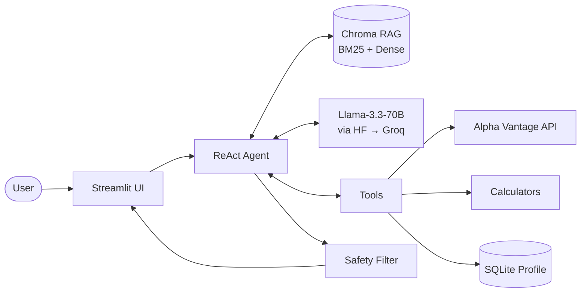
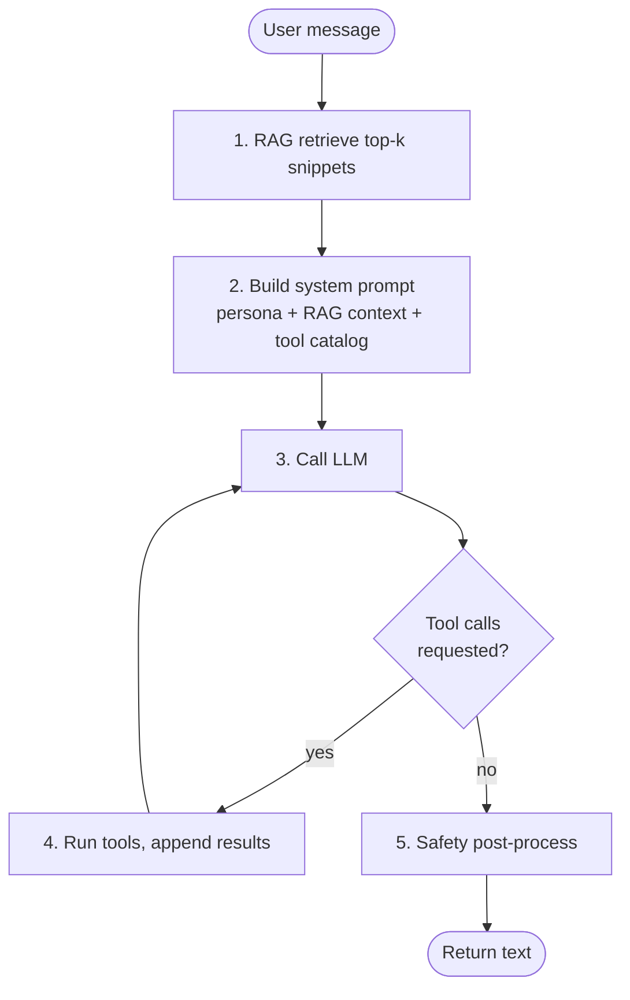
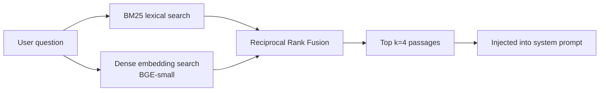
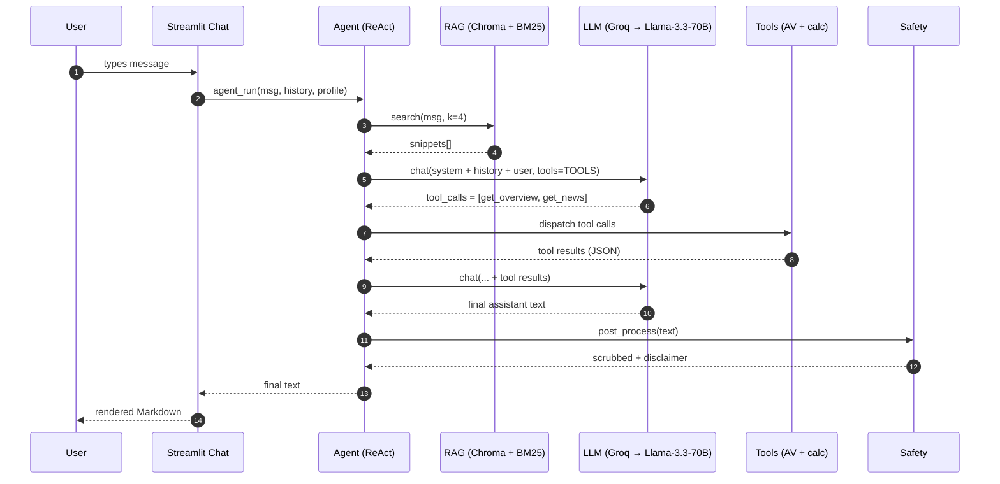

# FinAdvisor — Architecture & Request Pipeline

A structured walkthrough of how a user prompt becomes a grounded, tool-using response — and what each component contributes along the way.

---

## 1. The 30-second view



A single user message flows: **UI → Agent → (RAG + LLM + Tools) → Safety → UI**.

The agent is the orchestrator. The LLM is the brain. RAG provides facts. Tools provide actions and live data. Safety enforces guardrails on the way out.

---

## 2. The components — what each one does and why

### 2.1 Streamlit UI ([`app/`](app/))

| File | Role |
|---|---|
| [streamlit_app.py](app/streamlit_app.py) | Entry point + sidebar with persona form |
| [pages/1_Chat.py](app/pages/1_Chat.py) | Conversational chat |
| [pages/2_Portfolio.py](app/pages/2_Portfolio.py) | Holdings input → live quotes → allocation chart + LLM commentary |
| [pages/3_Goals.py](app/pages/3_Goals.py) | Retirement / savings / debt-payoff calculators + charts |
| [pages/4_Markets.py](app/pages/4_Markets.py) | Sector heatmap + news sentiment feed |

**Responsibility:** capture user input, render output, keep session state. The UI itself contains no financial logic — it's a thin presentation layer over the agent.

**Why Streamlit:** zero-config multi-page web app. One Python file = one page. `st.session_state` keeps chat history alive across reruns.

---

### 2.2 ReAct Agent ([`src/advisor/agent/react.py`](src/advisor/agent/react.py))

The orchestrator. Implements the **ReAct** (Reason + Act) pattern: the LLM thinks, decides whether to call a tool, the tool runs, the result feeds back into the LLM, and the loop continues until the LLM produces a final answer.



**Inputs:** user message, conversation history, user profile, retriever handle.

**Outputs:** a single string. The internal multi-step reasoning is collapsed for the user.

**Step budget:** capped at 6 LLM calls per user turn (the `MAX_STEPS` constant). Prevents runaway loops if the model keeps requesting tools.

---

### 2.3 LLM Client ([`src/advisor/llm/client.py`](src/advisor/llm/client.py))

Thin wrapper around `huggingface_hub.InferenceClient` — the OpenAI-compatible chat-completion API exposed by Hugging Face Inference Providers.

```python
chat(messages, tools=...) → OpenAI-shape response
```

**Why HF Inference Providers:** lets you use Llama-3.3-70B, Qwen, Mixtral, etc. with a single token. HF transparently routes requests to whichever backend (Groq, Fireworks, Together, Nebius) actually serves the model. We currently route through **Groq** because it's fastest.

**Provider-agnostic:** changing providers = changing one line in `.env`. Code never imports a provider-specific SDK.

---

### 2.4 Prompts ([`src/advisor/llm/prompts.py`](src/advisor/llm/prompts.py))

Three pieces of prompt content:

1. **`SYSTEM_PROMPT`** — the persona, principles ("educational, not advice"; "ground every claim"; "cite sources"), and output style.
2. **`format_persona()`** — turns the user's profile dict into a text block injected into the system prompt.
3. **`DISCLAIMER`** — the legal-tone footer appended by the safety layer.

This is where the LLM's behavior is mostly defined. No fine-tuning was done — domain adaptation is achieved through this prompt, the RAG context, and the tool catalog. (See FinGPT paper for the alternative path of LoRA fine-tuning.)

---

### 2.5 Tools ([`src/advisor/tools/`](src/advisor/tools/))

The agent's "hands". The LLM decides *which* tool to call based on the user's message; the agent executes the call and feeds the result back.

| Tool | Source | What it does |
|---|---|---|
| `get_stock_quote` | [alpha_vantage.py](src/advisor/tools/alpha_vantage.py) | Latest price, change, volume |
| `get_company_overview` | alpha_vantage.py | Sector, P/E, market cap, dividends |
| `get_news_sentiment` | alpha_vantage.py | Recent articles + sentiment scores |
| `get_technical_indicator` | alpha_vantage.py | RSI / SMA / EMA / MACD |
| `get_sector_performance` | alpha_vantage.py | All-sector return table |
| `get_fx_rate` | alpha_vantage.py | Realtime currency rate |
| `retirement_projection` | [calculators.py](src/advisor/tools/calculators.py) | Future-value of contributions |
| `savings_goal` | calculators.py | Required monthly savings to hit a target |
| `asset_allocation` | calculators.py | Stocks/bonds/cash split given age + risk |
| `debt_payoff` | calculators.py | Months and total interest to clear a debt |
| `emergency_fund` | calculators.py | 6-month-expenses target |

**Tool registry** ([registry.py](src/advisor/tools/registry.py)) defines two things:

- `TOOLS` — JSON Schema descriptions of each tool, sent to the LLM so it knows what's available.
- `DISPATCH` — Python dict mapping tool name → callable, so the agent can execute the LLM's chosen call.

**Why tools, not "ask the LLM to compute":** LLMs hallucinate numbers. A `retirement_projection` tool always returns the right answer; an LLM might be off by 30%. Same for live data — Alpha Vantage knows today's AAPL price; the LLM doesn't.

**Caching** — Alpha Vantage has a tight 25-requests/day free tier. `requests-cache` writes every response to disk for 30 minutes, so repeated dev runs don't burn quota.

---

### 2.6 RAG layer ([`src/advisor/rag/`](src/advisor/rag/))

Retrieval-Augmented Generation. Before the LLM sees the user's message, we look up relevant passages from a local knowledge base and inject them into the system prompt.



| File | Role |
|---|---|
| [ingest.py](src/advisor/rag/ingest.py) | One-time: walk `corpus/`, parse PDFs/MD, chunk, embed, store |
| [store.py](src/advisor/rag/store.py) | Chroma persistent client + collection accessors |
| [retrieve.py](src/advisor/rag/retrieve.py) | Hybrid retriever (BM25 + dense + RRF fusion) |

**Why hybrid:** dense embeddings (BGE) catch *semantic* matches ("retirement income" → IRA passages). BM25 catches *lexical* matches ticker symbols and acronyms. RRF (reciprocal rank fusion) is the cheapest way to merge two ranked lists into one.

**Why local Chroma:** no service to manage, embeddings and chunks live in `data/chroma/` as a single SQLite file, survives restarts.

**Source attribution:** every chunk carries its filename in metadata. The agent's prompt includes `[Source: glossary.md]` markers, and the LLM is instructed to cite them inline.

---

### 2.7 Safety ([`src/advisor/agent/safety.py`](src/advisor/agent/safety.py))

Three lightweight guards:

1. **`check_user_input`** — flags prompt-injection patterns ("ignore previous instructions") and sensitive distress signals ("bankruptcy") on the user's message. Just flags — never blocks.
2. **`scrub_directive_language`** — regex sweep over the LLM's output to remove "guaranteed profit" / "risk-free" / "can't lose" claims.
3. **`enforce_disclaimer`** — appends the standard "educational not advice" footer if the LLM didn't already include one.

Run via the single `post_process()` entry point at the end of every agent call.

**Why this is enough for a capstone:** real production safety needs much more (jailbreak classifiers, refusal models, content moderation APIs). For an educational demo, regex + disclaimer is honest about scope.

---

### 2.8 Memory ([`src/advisor/agent/memory.py`](src/advisor/agent/memory.py))

A SQLite database at `data/profile.db` with two tables:

- `profile(user_id, data)` — user's age, risk, goals, holdings, income.
- `conversation(user_id, ts, role, content)` — per-message log.

**Why SQLite:** single file, no service, gives you persistence across Streamlit restarts. Real production would use Postgres or Redis — overkill here.

**How it's used in the prompt:** at the start of every agent call, the profile is loaded and rendered into the system prompt as a **USER CONTEXT** block. That's how the LLM knows "this user is 30, moderate risk, focused on retirement" without you re-typing it every message.

---

### 2.9 Configuration ([`src/advisor/config.py`](src/advisor/config.py))

A single `Settings` object (pydantic-settings) reads from `.env`:

| Env var | What it controls |
|---|---|
| `HF_TOKEN` | Auth for the LLM provider |
| `ALPHA_VANTAGE_KEY` | Auth for live market data |
| `LLM_MODEL_ID` | Which model (e.g. `meta-llama/Llama-3.3-70B-Instruct`) |
| `LLM_PROVIDER` | Which HF backend (`groq`, `together`, `auto`, …) |
| `LLM_TEMPERATURE` | 0.0 = deterministic; 0.2 = our default |
| `EMBED_MODEL_ID` | Sentence-transformers model for RAG |

Every other module reads from `settings`, never from `os.environ` directly. One source of truth.

---

## 3. The full request lifecycle — a worked example

Imagine the user types this in the Chat page:

> *"I'm 30, moderate risk. Should I be worried about MSFT given today's news?"*

Here's what happens, step by step.

### Step 1 — UI hands off

[`pages/1_Chat.py`](app/pages/1_Chat.py) appends the message to `st.session_state.history` and calls:

```python
agent_run(prompt, history, profile, retriever)
```

### Step 2 — RAG retrieval

[`HybridRetriever.search()`](src/advisor/rag/retrieve.py) fires:

- BM25 finds passages with literal token overlap ("MSFT", "risk", "moderate").
- Dense BGE search finds semantically related passages ("Microsoft", "tech sector", "diversification").
- RRF merges into top-4. Each result is `{text, source, score}`.

These get formatted into a `[Source: glossary.md]\n<passage>` block.

### Step 3 — Prompt assembly

[`prompts.build_system_prompt()`](src/advisor/llm/prompts.py) stitches together:

```
You are FinAdvisor, …

USER CONTEXT
- Age: 30
- Risk tolerance: moderate
- Goals: retirement
- …

CAPABILITIES …

RELEVANT CONTEXT (use if helpful, cite when used):
[Source: glossary.md]
Diversification spreads investments across …
…
```

The full message list sent to the LLM:

```python
[
  {"role": "system", "content": <above>},
  ...prior history...,
  {"role": "user", "content": "I'm 30, moderate risk. Should I be worried about MSFT…"},
]
```

…plus the `tools=TOOLS` array describing every callable.

### Step 4 — First LLM call

The LLM (Llama-3.3-70B via Groq) reads the prompt, decides it needs **live data** to answer, and responds with **two parallel tool calls**:

```json
[
  {"name": "get_company_overview", "args": {"symbol": "MSFT"}},
  {"name": "get_news_sentiment",   "args": {"tickers": "MSFT", "limit": 10}}
]
```

No final text yet — just tool requests.

### Step 5 — Tool execution

Agent's loop dispatches each call:

- `get_company_overview("MSFT")` → cached Alpha Vantage hit returns sector, P/E, beta.
- `get_news_sentiment(tickers="MSFT")` → returns 10 recent articles with sentiment scores.

Both results are JSON-serialized, truncated to 4000 chars, and appended to the message list as `role: "tool"` messages.

### Step 6 — Second LLM call

Now the LLM has live data. It writes the final answer:

> "Microsoft is currently trading with a P/E around 35, in the Technology sector with beta 0.92 [Tool: get_company_overview]. Recent news sentiment over 10 articles is largely neutral-to-positive (avg score +0.18) [Tool: get_news_sentiment]. For a moderate-risk 30-year-old with a retirement goal, here are considerations: …"

This response has **no tool calls**, so the loop exits.

### Step 7 — Safety post-process

[`safety.post_process()`](src/advisor/agent/safety.py):

1. Regex-scrubs any "guaranteed" / "risk-free" claims.
2. Checks if the disclaimer is already present; appends it if not.

### Step 8 — UI render

The string returns to `pages/1_Chat.py`, which:

1. Appends it to `st.session_state.history`.
2. Logs to SQLite via `log_message()`.
3. Renders as Markdown in a `st.chat_message("assistant")` block.

Total wall-clock time on Groq: usually 3–8 seconds (two LLM round-trips + two AV API calls, often cached).

---

## 4. Sequence diagram of the full pipeline



---

## 5. Key design decisions

| Decision | What we did | Alternative considered | Why ours |
|---|---|---|---|
| Domain adaptation | Prompt + RAG + tool-use | LoRA fine-tune (FinGPT-style) | No GPU budget; faster iteration; matches production patterns |
| Agent framework | Custom ReAct loop in `react.py` | `smolagents`, LangGraph | Transparent for capstone presentation; ~80 lines |
| Retrieval | Hybrid BM25 + dense + RRF | Dense-only | BM25 catches tickers and acronyms dense embeddings miss |
| Vector DB | Chroma persistent | FAISS, Pinecone | Zero-config, file-backed, embedded |
| Provider | HF Inference Providers (Groq) | OpenAI / Anthropic direct | Open-weights option matches FinGPT thesis; provider-agnostic |
| Memory | SQLite | Redis, in-memory | Survives restarts; one file; no infra |
| Safety | Regex + disclaimer | Refusal classifier, content moderation API | Honest scope for capstone; cheap and obvious |
| UI | Streamlit | FastAPI + React | 10x faster to ship a polished demo |

---

## 6. What lives where — file map

```
financial-advisor-llm/
├── app/                          ← Presentation
│   ├── streamlit_app.py          (sidebar persona + landing)
│   └── pages/                    (Chat, Portfolio, Goals, Markets)
│
├── src/advisor/                  ← Library
│   ├── config.py                 (Settings ← .env)
│   ├── llm/
│   │   ├── client.py             (HF Inference Providers wrapper)
│   │   └── prompts.py            (system prompt + persona + disclaimer)
│   ├── tools/
│   │   ├── alpha_vantage.py      (live market data, cached)
│   │   ├── calculators.py        (deterministic finance math)
│   │   ├── profile.py            (read/write via memory.py)
│   │   └── registry.py           (TOOLS schema + DISPATCH table)
│   ├── rag/
│   │   ├── ingest.py             (corpus → chunks → Chroma)
│   │   ├── store.py              (Chroma client)
│   │   └── retrieve.py           (BM25 + dense + RRF)
│   ├── agent/
│   │   ├── react.py              (the loop)
│   │   ├── memory.py             (SQLite profile + conversation)
│   │   └── safety.py             (pre + post filters)
│   └── eval/
│       ├── fpb.py                (Financial PhraseBank sentiment task)
│       ├── tasks.py              (10 custom prompts + LLM-as-judge)
│       └── runner.py             (CLI glue)
│
├── corpus/                       ← Source docs for RAG
├── data/                         ← Caches, Chroma DB, profile DB (gitignored)
├── scripts/                      ← CLI entry points
└── tests/                        ← pytest suite
```

---

## 7. What this lets us claim, and what it doesn't

**Claims supported by this architecture:**

- The system gives **personalized** answers (profile in prompt).
- The system gives **current** answers (live tool calls).
- The system gives **grounded** answers (RAG + tool citations).
- The system gives **safe** answers (disclaimer + scrubbing + refusal-friendly system prompt).

**Claims it does NOT support:**

- The LLM has been "trained on financial data" — it hasn't. Llama-3.3 is general-purpose; we adapted it through prompt + RAG + tools, not weights.
- The system gives **regulated investment advice** — it doesn't. It explicitly disclaims this.
- The numbers are guaranteed correct — calculators are deterministic, but live data could be stale (cache TTL) or wrong (Alpha Vantage can have hiccups), and the LLM can still misinterpret tool output.

**Future extensions** (good slide content for your capstone presentation):

1. Add LoRA fine-tuning on Financial PhraseBank for sentiment-task accuracy → that's exactly the FinGPT path we deferred.
2. Replace regex safety with an Anthropic / OpenAI moderation classifier.
3. Add a portfolio backtest tool that simulates the agent's allocation suggestion against historical AV data.
4. Stream tokens to Streamlit (`st.write_stream`) for snappier UX.
5. Multi-tenant memory (today everything is `demo-user`).

---

## 8. References

- Yang, Liu, Wang. *FinGPT: Open-Source Financial Large Language Models.* arXiv:2306.06031 (2023). — The reference paper that motivated this capstone; we built the inference-side path complementary to their training-side path.
- Yao et al. *ReAct: Synergizing Reasoning and Acting in Language Models.* ICLR 2023. — The agent-loop pattern.
- Cormack, Clarke, Buettcher. *Reciprocal Rank Fusion outperforms Condorcet and individual Rank Learning Methods.* SIGIR 2009. — Why we use RRF for hybrid retrieval.
- Hugging Face Inference Providers docs: https://huggingface.co/docs/inference-providers/
- Alpha Vantage API: https://www.alphavantage.co/documentation/
