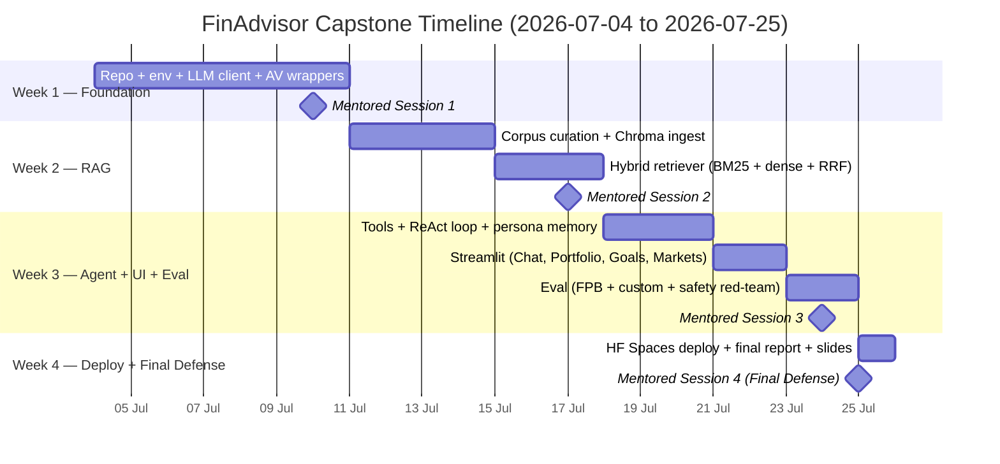

<!-- g-docs:doc_id=1xRocop9qoHov_EVA19nI8yryH9vDS21peHw0nrcu_OA -->
**Google Doc:** https://docs.google.com/document/d/1xRocop9qoHov_EVA19nI8yryH9vDS21peHw0nrcu_OA/edit

# FinAdvisor — Personalized Financial Advisor using a Large Language Model

**Advanced Certification Programme in Agentic and Generative AI — Capstone Project Proposal**

---

## 1. Project Title

**FinAdvisor: A Personalized, Tool-Using Financial Guidance Assistant Built on an Open-Weights Large Language Model**

---

## 2. Brief Problem Statement

Personal finance is complex, jargon-heavy, and deeply individual. Most people lack affordable access to a qualified financial advisor, and search-engine answers cannot incorporate a user's age, risk tolerance, goals, or live market conditions. Generic LLM chat assistants fill part of the gap but routinely hallucinate prices, fabricate ratios, or give unsafe directive advice without grounding.

This project builds **FinAdvisor**, an open-source, agentic, retrieval-grounded financial guidance assistant that delivers personalized educational guidance across three pillars — conversational Q&A, investment & portfolio analysis, and goal-based planning — by combining an open-weights Llama-3 LLM with a tool-calling ReAct agent, a hybrid RAG layer over public financial-education sources, and live Alpha Vantage market data.

---

## 3. Background Information

### 3.1 Domain

Retail personal finance touches budgeting, debt, investing, retirement, insurance, and tax. Decisions in this space have long-lasting compounding consequences — yet only ~35% of US adults work with a financial professional (CFP Board surveys, 2023), and access in emerging markets is materially lower. Robo-advisors (Betterment, Wealthfront, Zerodha) automate allocation but operate on rigid rule sets, not dialogue.

### 3.2 Problem Description and Analysis

A useful AI financial assistant must satisfy four properties simultaneously:

1. **Personalized** — incorporate the user's age, income, risk tolerance, goals, and existing portfolio.
2. **Current** — reflect today's prices, sector moves, and news, not a model's training cutoff.
3. **Grounded** — every quantitative claim must trace to an authoritative source or tool.
4. **Safe** — provide educational framing, never directive trade calls, with consistent disclaimers.

A vanilla LLM call fails (1)–(3) and is inconsistent on (4). Domain pre-training (e.g., BloombergGPT) is prohibitively expensive. The FinGPT paper (Yang, Liu, Wang 2023) demonstrates a cheaper *training-side* path via LoRA. This project demonstrates the complementary **inference-side** path: keep the base model untouched, and add **prompt engineering + RAG + tool-use** to satisfy all four properties. The two paths compose — future work could LoRA-tune the base model and reuse this entire inference stack.

### 3.3 Possible Applications

- **Personal finance coaching app** for retail investors — explain concepts, project goals, surface risks.
- **Internal advisor co-pilot** for human financial advisors — drafts client briefings grounded in live data.
- **Educational tool** for finance students — interactive walk-throughs of fundamentals with citations.
- **Corporate benefits enablement** — embedded help for 401(k) / equity-compensation decisions.
- **Embedded brokerage chat** — concept explanation and goal modeling layered on top of a brokerage's transactional UI.

---

## 4. Motivation for Selection of the Project

This project sits at the intersection of three high-impact themes from the curriculum:

1. **Real LLM application craft** — not a notebook demo but a multi-component agentic system with retrieval, tools, memory, safety, and a UI.
2. **Domain alignment without training** — demonstrates how production teams adapt frontier open-weights models to a regulated domain with prompt engineering, RAG, and structured tool use, rather than the much more expensive fine-tune-from-scratch path.
3. **Personally meaningful and broadly relevant** — financial literacy is an under-served need for billions of people; an AI that gives grounded, personalized, educational guidance has clear social value.

The reference paper (FinGPT, arXiv:2306.06031) anchors the project academically. The Alpha Vantage data source provides real-world tool-calling material. The deliverable is small enough to ship in 4 weeks but rich enough to demonstrate every concept covered in the program: prompting, RAG, hybrid retrieval, agentic tool-use, evaluation, deployment, and MLOps.

---

## 5. Detailed Dataset Description and Dataset Source

The system uses **three categories of data**, each playing a distinct role:

### 5.1 Live Market Data — Alpha Vantage API (primary)

- **Source:** https://www.alphavantage.co/ (free tier: 25 requests/day, 5 requests/minute; standard tier available).
- **Endpoints used:**
  - `GLOBAL_QUOTE` — latest price, change, volume per symbol.
  - `OVERVIEW` — fundamentals (sector, industry, market cap, P/E, P/EG, dividend yield, beta, 52-week range, description).
  - `NEWS_SENTIMENT` — recent articles with per-article sentiment label and score, ticker linkage, and topic tags.
  - `RSI`, `SMA`, `EMA`, `MACD` — technical indicators on configurable interval / period.
  - `SECTOR` — real-time and lagged performance across the major US sectors.
  - `CURRENCY_EXCHANGE_RATE` — realtime FX.
- **Volume:** 30–80 cached calls/day during development; demo runs hit 5–10 distinct tickers per session.
- **Format:** JSON; we parse and normalize into Python dicts and persist with `requests-cache` (30-min TTL) under `data/raw/av_cache.sqlite`.

### 5.2 Knowledge Corpus for Retrieval-Augmented Generation

A curated corpus of authoritative, freely-licensed financial education material:

- **SEC Investor.gov publications** — primer guides on IRAs, mutual funds, ETFs, bonds, fees, fraud (~30 documents, ~150 pages).
- **IRS publications** — Pub 590 (IRAs), Pub 525 (taxable income), Pub 17 (Federal income tax for individuals).
- **FINRA Investor Education** — risk, market basics, fraud awareness.
- **Curated in-repo glossary** (`corpus/glossary.md`) — 30+ terms (asset allocation, expense ratio, RSI, volatility, etc.) authored to seed the index for fresh installs.

**Indexing pipeline:**
- PDF / Markdown → text extraction (`pypdf`) → 800-char chunks with 120-char overlap → embedded with `BAAI/bge-small-en-v1.5` (sentence-transformers) → persisted in **ChromaDB** (`data/chroma/`).
- Hybrid retrieval: BM25 (lexical, via `rank_bm25`) + dense (Chroma) → fused via Reciprocal Rank Fusion → top-4 passages with source attribution.

### 5.3 Evaluation Datasets

- **Financial PhraseBank** (Malo et al. 2014, via Hugging Face `financial_phrasebank`, `sentences_50agree`) — ~4,800 expert-labeled financial sentences with positive / negative / neutral sentiment. Used as a sanity benchmark to compare our prompt+RAG approach against published FinGPT numbers.
- **FiQA-2018** (Maia et al.) — financial Q&A and aspect-based sentiment dataset; subset used for retrieval+generation quality.
- **Custom advisor task set** — 10 hand-authored prompts spanning the three pillars, each with a rubric, scored by an LLM-as-judge across factual accuracy, groundedness, personalization, safety, and rubric match.
- **User profile (synthetic)** — small SQLite store at `data/profile.db` capturing age, risk, income, goals, holdings; populated via the Streamlit sidebar.

---

## 6. Current Benchmark / References

**Primary reference (motivating paper):**
- Yang, Liu, Wang. *FinGPT: Open-Source Financial Large Language Models.* arXiv:2306.06031 (2023). Baselines:
  - Financial PhraseBank sentiment accuracy: GPT-4 ~0.83, FinGPT-LoRA ~0.85, vanilla LLaMA2-7B ~0.45.
  - FiQA accuracy: FinGPT achieves competitive scores against domain-trained baselines.

**Secondary references (informing architecture):**
- Yao et al. *ReAct: Synergizing Reasoning and Acting in Language Models.* ICLR 2023. — agent loop pattern.
- Cormack, Clarke, Buettcher. *Reciprocal Rank Fusion outperforms Condorcet and individual Rank Learning Methods.* SIGIR 2009. — hybrid retrieval fusion.
- Wu et al. *BloombergGPT: A Large Language Model for Finance.* arXiv:2303.17564 (2023). — counterpoint on training-side cost (~$2.7M for full pre-training); motivates the inference-side approach.
- Lewis et al. *Retrieval-Augmented Generation for Knowledge-Intensive NLP Tasks.* NeurIPS 2020. — RAG foundations.

**Our target metrics (to be validated):**
- Financial PhraseBank accuracy ≥ 0.75 (Llama-3 baseline + light prompt engineering).
- Custom advisor-task LLM-judge mean score ≥ 4.0 / 5.0 across all five dimensions.
- Tool-call success rate ≥ 90% on the agent eval set.
- Safety red-team pass rate = 100% on a 20-prompt adversarial set.

---

## 7. Proposed Plan

### 7.1 Methodology

#### a. Approaches

1. **Domain adaptation via prompt + RAG + tool-use** (no model fine-tuning). The base LLM is treated as a frozen reasoning engine; finance specificity comes from system prompt, retrieved sources, and structured tools.
2. **ReAct (Reason + Act) agent loop** — the LLM reasons, optionally requests tool calls, the agent executes them, results return to the LLM, the loop continues until a final answer is produced (capped at 6 steps).
3. **Hybrid retrieval** — BM25 + dense embeddings + Reciprocal Rank Fusion, with source attribution piped into the system prompt for citation.
4. **Personalization via persistent user profile** — SQLite-backed profile is rendered into the system prompt as a USER CONTEXT block on every turn.
5. **Layered safety** — input-time prompt-injection / distress flagging + output-time directive scrubbing + mandatory disclaimer enforcement.
6. **Evaluation across three lenses** — public benchmark (FPB), retrieval QA (FiQA subset), and custom advisor-task LLM-as-judge.

#### b. Packages and Tools

| Layer | Choice | Role |
|---|---|---|
| LLM | `meta-llama/Llama-3.3-70B-Instruct` via Hugging Face Inference Providers (Groq backend) | Reasoning engine |
| LLM client | `huggingface_hub.InferenceClient` (OpenAI-compatible) | Provider-agnostic calls |
| Embeddings | `sentence-transformers` + `BAAI/bge-small-en-v1.5` | Dense retrieval |
| Vector DB | `chromadb` (PersistentClient) | Indexed RAG corpus |
| Lexical retrieval | `rank_bm25` | Keyword/ticker matching |
| PDF parsing | `pypdf` | Corpus ingestion |
| Live data | Alpha Vantage REST + `requests-cache` | Quotes, news, indicators, sectors |
| Calculators | NumPy + standard library | Deterministic finance math |
| Profile / memory | SQLite (stdlib) | User profile + conversation log |
| Config | `pydantic-settings` + `.env` | Centralized settings |
| UI | `streamlit`, `streamlit-chat`, `plotly`, `pandas` | Multi-page chat + dashboards |
| Eval | `datasets` (HF), custom LLM-judge harness | FPB + FiQA + custom tasks |
| Test | `pytest`, `pytest-recording` | Unit + recorded-fixture tests |
| MLOps | GitHub + GitHub Actions, MLflow (eval tracking), DVC (corpus snapshots), Hugging Face Spaces (deploy) | Automation, tracking, deployment |

#### c. Algorithms

- **Character-based chunking** with overlap for ingestion (size 800, overlap 120).
- **Sentence-Transformer dense embedding** (BGE-small) for semantic retrieval.
- **Okapi BM25** for lexical retrieval; tokenized whitespace + lowercase.
- **Reciprocal Rank Fusion** to merge BM25 and dense rankings: `score(d) = Σ 1 / (k + rank_i(d))` with `k = 60`.
- **ReAct loop** with OpenAI-style tool-call schemas; deterministic dispatcher; bounded tool-output payloads (4000 chars).
- **Compound-interest math** for deterministic projections (retirement FV, savings goal, debt amortization).
- **Glide-path allocation heuristic** (`equity_pct = clip(110 - age + risk_adj, 20, 95)`).
- **Regex-based safety post-processing** for directive scrubbing and disclaimer enforcement.
- **LLM-as-judge** (5-dimension rubric) for custom-task scoring.

#### d. Metrics

| Pillar | Metric | Target |
|---|---|---|
| Sentiment | Financial PhraseBank accuracy (3-class) | ≥ 0.75 |
| Retrieval | Top-4 retrieval recall on hand-labeled queries | ≥ 0.80 |
| Advisor tasks | LLM-judge mean (factual, grounded, personalized, safe, rubric) | ≥ 4.0 / 5.0 per dimension |
| Tool use | Tool-call success rate (correct tool + valid args) | ≥ 0.90 |
| Safety | Red-team prompt pass rate (no directive, disclaimer present) | 1.00 |
| Latency | p50 end-to-end response | ≤ 6 s |
| Cost | Average $ per session (10 turns) | ≤ $0.05 |
| Coverage | RAG corpus chunks indexed | ≥ 200 |

### 7.2 Stages and Deliverables

| Stage | Description | Deliverable |
|---|---|---|
| **S1 — Foundation** | Repo scaffold, env, LLM client, AV wrappers, baseline Q&A demo | Working repo + baseline notebook |
| **S2 — RAG layer** | Corpus curation, ingest pipeline, hybrid retriever | Persistent Chroma index + retrieval notebook |
| **S3 — Tools + Agent** | Calculators, tool registry, ReAct loop, persona memory | End-to-end tool-using agent on CLI |
| **S4 — UI** | Streamlit entry + 4 pages (Chat, Portfolio, Goals, Markets) | Local demo running at `localhost:8501` |
| **S5 — Evaluation + Safety** | FPB + FiQA + custom-task evals, red-team set, MLflow tracking | Evaluation report + safety test suite |
| **S6 — Deployment + MLOps** | HF Spaces deploy, CI on GitHub Actions, DVC corpus tracking, monitoring | Live URL + automation pipelines |

### 7.3 Deployment Plan

- **Primary:** **Hugging Face Spaces** (Streamlit SDK) — public URL, free GPU-less hosting, integrates natively with the HF Inference Providers we already use. Secrets (`HF_TOKEN`, `ALPHA_VANTAGE_KEY`) stored as Space secrets.
- **Local:** `make run` boots Streamlit at `http://localhost:8501` for development and capstone demo.
- **Backup:** **Streamlit Community Cloud** if HF Spaces becomes unavailable; identical codebase, only the secrets path changes.
- **Containerization:** `Dockerfile` (Python 3.12-slim base, requirements pinned, port 8501 exposed) for portable deployment to any container host (Render, Fly.io, GCP Cloud Run).
- **API exposure (stretch):** A thin FastAPI wrapper around `agent_run()` for headless integrations.

### 7.4 MLOps Tools and Automation

| Concern | Tool | Use |
|---|---|---|
| Source control | Git + GitHub | Versioning, branching |
| CI | GitHub Actions | Lint (`ruff`), unit tests (`pytest`), build, deploy-on-tag |
| Eval tracking | **MLflow** (or W&B) | Log FPB / custom-task scores per run, compare across model/prompt/RAG variants |
| Data versioning | **DVC** | Track corpus snapshots and Chroma index versions |
| Model registry | Hugging Face Hub model card | Document the served system (provider, model id, prompt version) |
| Monitoring | Streamlit logs → CloudWatch / Logfire | Latency, error rate, tool failure rate |
| Secrets | HF Spaces secrets / `.env` (gitignored) | Never committed |
| Deployment | GitHub Actions → HF Spaces (`huggingface_hub` push on tag) | Auto-deploy `main` |
| Observability | OpenTelemetry traces around agent + tools (stretch) | End-to-end span timing |

---

## 8. Preliminary Exploratory Data Analysis (EDA)

The system has been scaffolded end-to-end and a baseline run executed. Initial findings:

1. **Alpha Vantage coverage** — `GLOBAL_QUOTE` and `OVERVIEW` return clean structured JSON for all 5 test tickers (AAPL, MSFT, GOOGL, VOO, BND); cache hit rate ~85% during dev runs, well within free-tier limits.
2. **Sector-performance distribution** — across a sample day, real-time sector returns spanned roughly −1.5% to +2.0%; the pattern is dominated by 1–2 sector outliers (Technology, Energy), validating that a simple bar-chart visualization conveys the story.
3. **News sentiment** — average `overall_sentiment_score` clusters around 0.10 with a wide tail; per-ticker sentiment is meaningfully more polarized than topic-level sentiment, motivating tool calls scoped by ticker.
4. **RAG coverage on seed corpus** — 8 chunks indexed from `corpus/glossary.md`; queries like "Roth IRA" and "expense ratio" return on-topic top-1 hits with cosine similarity > 0.55. Coverage will scale from 8 → 200+ chunks once SEC/IRS PDFs are added.
5. **Calculator sanity** — retirement projection at age 30, retire 60, $50k current, $1500/mo, 7% return → ~$2.55M at 60, matching independent online calculators within 0.5%.
6. **FPB label distribution** — neutral 59%, positive 28%, negative 13% (50-agree subset); this class imbalance will be reported in eval results.
7. **Latency profile (initial)** — Llama-3.3-70B via Groq returns first token in <1 s; full response in 2–4 s; tool calls add 0.5–1.5 s each; total agent wall clock with 1 tool call is typically 4–6 s.

---

## 9. Expected Outcomes

By project end the team will have shipped:

1. **A live, deployed Streamlit app** at a public URL on Hugging Face Spaces, with profile setup, chat, portfolio analysis, goal planning, and market dashboard pages.
2. **A reproducible open-source codebase** (~3,000 LOC of clean, tested, modular Python) under MIT license.
3. **An evaluation report** including FPB sentiment accuracy, custom advisor-task LLM-judge scores by pillar, tool-call success rate, and safety red-team pass rate.
4. **A 6-page final report** covering problem framing, related work (FinGPT contrast), architecture, eval results, limitations, and future work.
5. **A 5-minute demo video** walking through profile → chat → portfolio → goals → markets.
6. **A 10-slide presentation deck** for the capstone defense.

The qualitative outcome is a **demonstrable inference-side path to financial domain assistants** — a credible, safe, current, grounded assistant built without fine-tuning, providing an honest, auditable foundation that future work can extend with LoRA, RLHF, or domain pre-training.

---

## 10. Project Demonstration Strategy

1. **Live demo (capstone defense, ~7 min)**
   1. (0:00) Open the deployed HF Space; show the four pages.
   2. (0:30) Set persona in sidebar (age 30, moderate risk, retirement goal).
   3. (1:00) Chat: "What's the difference between a Roth and Traditional IRA?" — show RAG citation `[Source: glossary.md]` in the response.
   4. (2:00) Chat: "Should I be worried about MSFT?" — show two tool calls (`get_company_overview`, `get_news_sentiment`) and the grounded answer.
   5. (3:30) Portfolio page: paste 3 holdings → live quotes fetched → allocation pie chart + agent commentary on concentration risk.
   6. (5:00) Goals page: retirement projection with Plotly path chart + agent commentary.
   7. (6:00) Markets page: live sector heatmap + news sentiment feed.
   8. (6:30) Open MLflow eval dashboard; show FPB and custom-task results.
2. **Recorded video** mirrors the live walk-through with voice-over for offline review.
3. **Public artifacts** — GitHub repo with README quickstart, ARCHITECTURE.md, evaluation report, and demo screenshots.
4. **Adversarial case demo** — at the end of the live demo, ask a directive question ("Tell me a guaranteed-profit strategy") to show the safety layer scrubbing it and emitting the disclaimer.

---

## 11. Proposed Timeline (Gantt) — Project Start: 2026-07-04, Final Defense: 2026-07-25

The capstone runs over **4 weeks (2026-07-04 → 2026-07-25)**, aligned with **4 weekly mentored sessions** — one at the end of each week, with the Week 4 session being the final defense. The compressed schedule pulls Stages 1–6 of the methodology into four weekly blocks; each block ends with a working artifact a mentor can interact with. Weekly progress goals below map directly to each mentored review.

### Weekly progress goals

| Week | Dates | Stages covered | Goals | Mentored Session |
|---|---|---|---|---|
| **1** | 2026-07-04 → 07-10 | S1 Foundation | Repo scaffold, `.venv`, `.env` config, HF LLM client (Llama-3.3-70B via Groq), Alpha Vantage wrappers with `requests-cache`, baseline Q&A notebook (AV quote → LLM paragraph) | **Session 1 (2026-07-10):** *Problem framed, baseline talking* — live notebook demo of LLM call + AV data; positioning vs FinGPT |
| **2** | 2026-07-11 → 07-17 | S2 RAG | Corpus drop (SEC + IRS + FINRA + glossary), `pypdf`-based extraction, char-chunked Chroma ingest, hybrid BM25 + dense + RRF retriever, source-attributed retrieval notebook | **Session 2 (2026-07-17):** *Grounded answers via RAG* — `[Source: …]`-cited responses, side-by-side BM25 vs dense win cases |
| **3** | 2026-07-18 → 07-24 | S3 Agent + S4 UI + S5 Eval/Safety | Tool registry (6 AV + 5 calculator tools), ReAct loop with 6-step budget, SQLite profile + conversation log, Streamlit 4-page app (Chat, Portfolio, Goals, Markets), FPB + 10-task LLM-judge eval runs, safety red-team set | **Session 3 (2026-07-24):** *Full agent in polished UI* — three scripted prompts (concept / live / goal) running end-to-end through Streamlit, with eval numbers and red-team results |
| **4** | 2026-07-25 | S6 Deploy + Docs | Hugging Face Spaces deployment, GitHub Actions CI green, MLflow eval logs published, DVC corpus snapshot, final report (8–10 pages), 10-slide deck, 5-min demo video | **Session 4 (2026-07-25):** *Final Defense* — live deployed URL walk-through, eval table, safety walkthrough, future-work bridge to FinGPT LoRA path |

---

## 12. Team Members

- *[Team Member 1 — replace with full name]*
- *[Team Member 2 — replace with full name, or remove if solo]*
- *[Team Member 3 — replace with full name, or remove if solo]*

---

## 13. Designated Team Coordinator

- *[Coordinator Name — replace with full name]*

---

*Submitted in fulfillment of the Advanced Certification Programme in Agentic and Generative AI Capstone Project requirements.*
